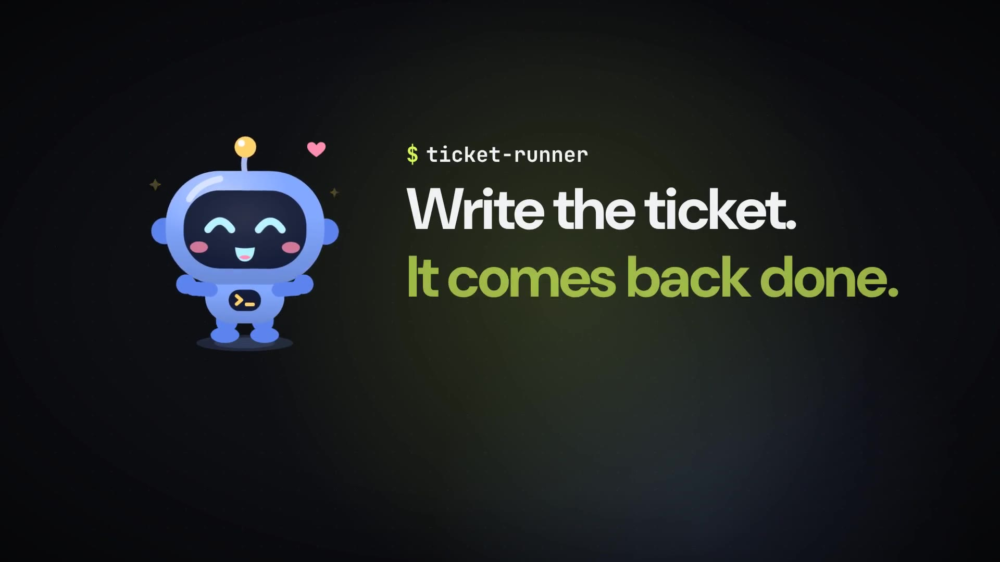
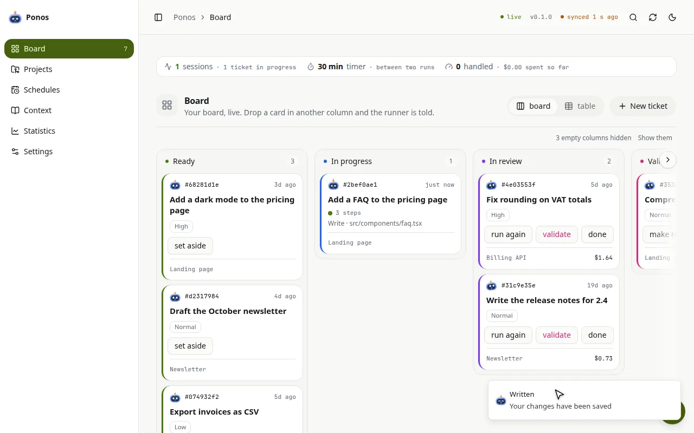
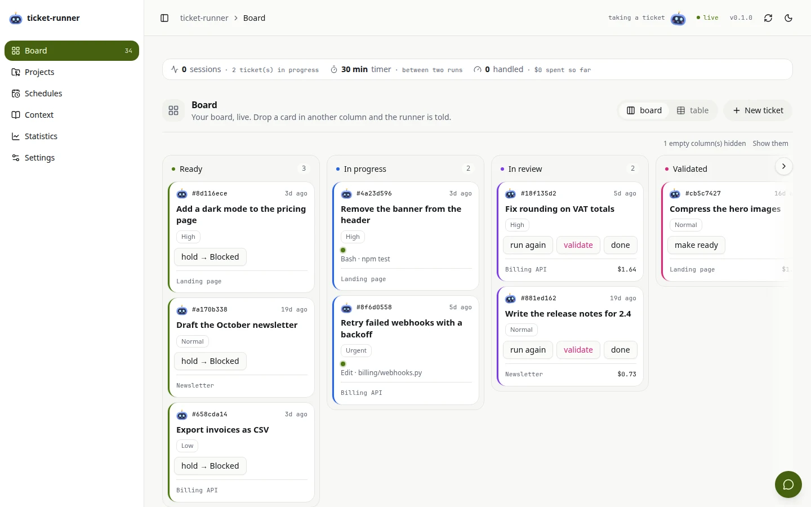
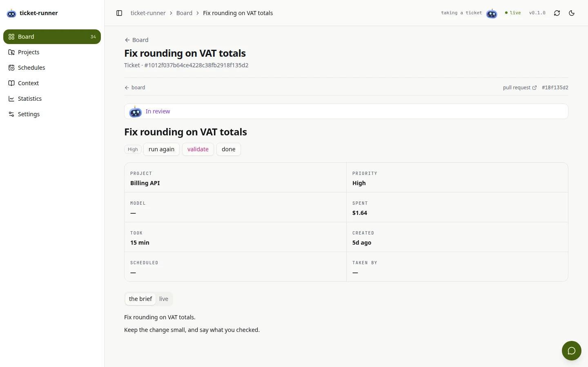
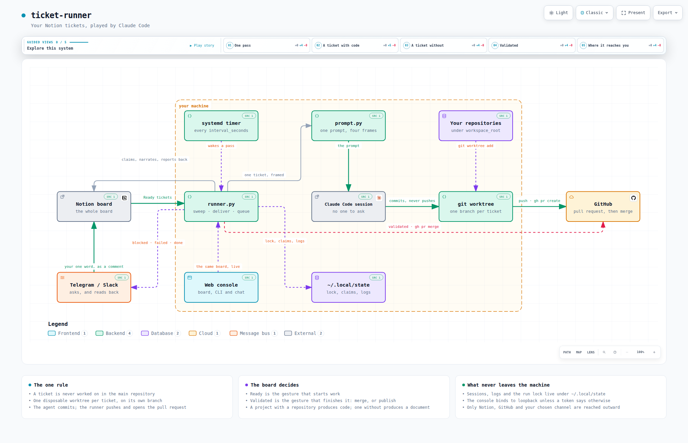
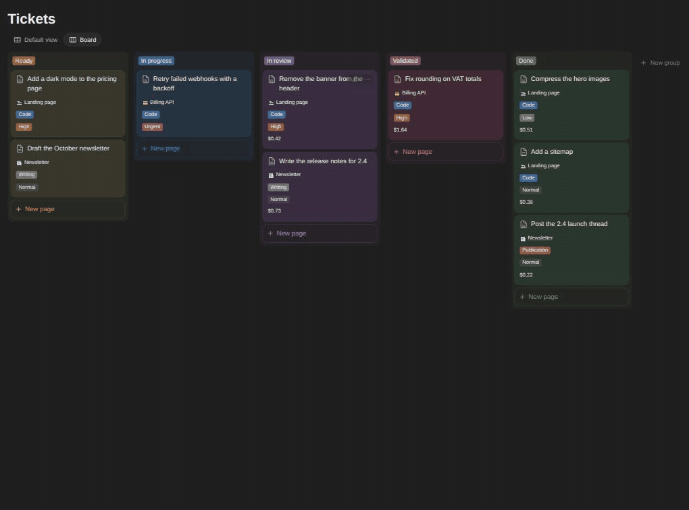
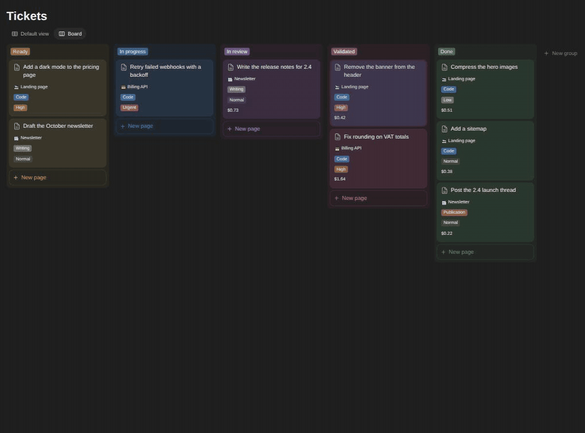
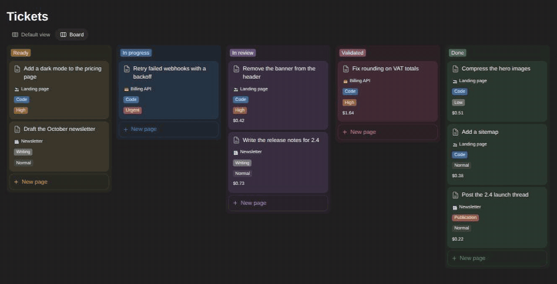
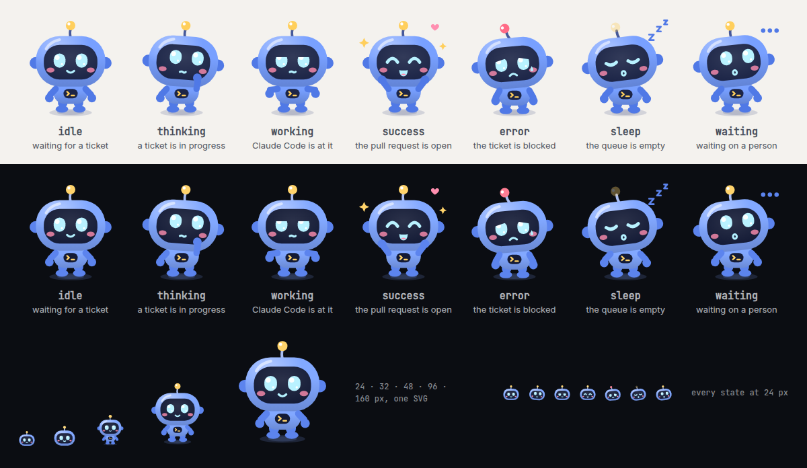

<p align="center">
  <a href="https://cardona.digital/ponos/"></a>
</p>

<h1 align="center">Ponos</h1>

<p align="center">
  <strong>Write the ticket. It comes back done.</strong><br>
  <em>Écris le ticket. Il revient fait.</em>
</p>

<p align="center">
  <a href="https://github.com/SalvadorCardona/ponos/actions/workflows/ci.yml"></a>
  <a href="LICENSE"></a>
  <a href="CHANGELOG.md"></a>
  <a href="#installation"></a>
  <a href="tests/run.py"></a>
</p>

<p align="center">
  <a href="https://cardona.digital/ponos/"><b>📖 The documentation, online</b></a> ·
  <a href="https://cardona.digital/ponos/#video"><b>▶ The one-minute video</b></a> ·
  <a href="#install-it"><b>Install</b></a> ·
  <a href="CHANGELOG.md"><b>CHANGELOG</b></a>
</p>

**A harness around [Claude Code](https://claude.com/claude-code) that runs your tasks on
your machine — code, writing, actions, posts.**

Write the ticket on **Ponos**'s own board — the console, or a folder of Markdown files. He
brings back a pull request, a text, an action carried out or a post ready to go. You answer
in a word, even from your phone, and nothing ships until you say yes. Notion, GitHub,
Telegram, Slack and OpenRouter plug in when you want them; none of them is required.

[](https://cardona.digital/ponos/#video)

<sub>▶ **[Ponos in a minute](https://cardona.digital/ponos/#video)** — one ticket, from *Ready* to *Done*. The video plays on the site, sound on.</sub>

The name is a robot's, after the Greek god of toil: he does the tedious part of a ticket in
your place, and you keep the decisions. The repository, the `ponos` command, the Python
package and every path on your machine carry his name too. An installation from before the
rename moves over on its own — see the [CHANGELOG](CHANGELOG.md) for what it does.

## The loop, in four gestures

Two of them are yours, and each takes a few seconds. The two in between are Ponos's.

1. **You write the ticket** — what you would tell a colleague, on your board — then you
   move it to *Ready*.
2. **Ponos does it** while you do something else: a pull request on its own branch, a text
   written into the ticket, an action carried out.
3. **You read, and answer in a word.** A question or a result reaches you — in the
   console, or on your phone. *oui* is a whole answer.
4. **He delivers.** Move it to *Validated*: the pull request is merged, the post is
   published — and only then is it *Done*.

<p align="center">
  <a href="https://cardona.digital/ponos/#loop">
    <picture>
      <source media="(prefers-color-scheme: dark)" srcset="docs/media/console-loop-dark-poster.webp">
      
    </picture>
  </a>
  <br><sub>The console, filmed doing the four gestures — <a href="https://cardona.digital/ponos/#loop">the film plays on the site</a>.</sub>
</p>

## Three things it does that a to-do list does not

- **It asks first — a doubt stops it.** A ticket nobody typed is classified before it
  runs, and a hesitation sends it back to you with the question. An action stops at its
  first doubt — a wrong account, a value the ticket does not give — rather than act on a
  guess. See [The type of a ticket](#the-type-of-a-ticket).
- **You keep the hand — nothing goes out without you.** No pull request is merged and
  nothing is published until you move the ticket to *Validated*. And it all runs on your
  machine, each ticket in a disposable worktree — your own checkout is never touched. See
  [What protects your code](#what-protects-your-code).
- **It comes to you — “oui” is enough.** When a ticket needs a decision, the question
  reaches you on **Telegram or Slack**, and your reply lands on the ticket. See
  [Being told, and answering with one word](#being-told-and-answering-with-one-word).

**Not only code — four kinds of task.** The ticket's type decides the road: pick it, or let
a small model read the ticket and choose.

| Type | A ticket | What comes back |
| --- | --- | --- |
| **Code** | *Console: limit the Done column* | A pull request, on its own branch and a disposable worktree; the tests run. Merged when you validate. |
| **Writing** | *Draft the October newsletter* | A text, written into the ticket, ready to copy. No repository needed. |
| **External action** | *Add the DNS records for the new domain* | Done in the browser or a service's settings, with every change logged. It stops at its first doubt. |
| **Publication** | *Post the 1.2 release on LinkedIn* | Prepared and shown to you first. Published once you say yes. |

Tickets also [come back on their own](#what-comes-back-on-its-own) on a schedule, and the
console's chat is a Claude Code session in your workspace.

## A board of its own

Ponos needs nobody else's board. The [console](#the-web-console), on `127.0.0.1`, is where
you write a ticket, drag it to *Ready* and watch its session live. Under it, the board is
[a folder of Markdown files](#without-notion-the-board-as-markdown-files): `grep`, your
editor and `git` read it too.

<p align="center">
  <picture>
    <source media="(prefers-color-scheme: dark)" srcset="docs/console/board-dark.webp">
    
  </picture>
  <picture>
    <source media="(prefers-color-scheme: dark)" srcset="docs/console/ticket-dark.webp">
    
  </picture>
</p>

Everything runs on your machine; the board, GitHub and your channel are the only things it
reaches — see [Architecture](#architecture).

<p align="center">
  <a href="#architecture"></a>
</p>

## Plugs in where you already work. If you want.

Ponos needs Claude Code and nothing else. Each of these is one more token in the settings,
and none of them is a requirement.

| | Optional | |
| --- | --- | --- |
| <a href="#the-notion-side"><picture><source media="(prefers-color-scheme: dark)" srcset="docs/media/notion/made-for-notion-black.svg"></picture></a> | **Your board in Notion.** | Tickets, projects and schedules become Notion databases, and every report is written back on the ticket's page. [The Notion side](#the-notion-side) |
| **GitHub** | **Pull requests.** | A code ticket comes back as one, through `gh`, and is merged on your yes. Writing, actions and posts need none of it. [Several GitHub accounts](#several-github-accounts) |
| **Telegram · Slack** | **Your phone.** | A question or a result reaches you there, and your answer — *oui* will do — lands on the ticket. [Telegram and Slack](#being-told-and-answering-with-one-word) |
| **OpenRouter** | **Every other model.** | One key: a GPT writes the copy, a model transcribes a voice note — or the sessions themselves run on the model you name. [Every other model](#every-other-model) |

## Install it

One command. It installs the `ponos` command, a timer that hands Ponos the ready tickets,
and the console. Beyond Claude Code, nothing to sign up for.

```sh
curl -LsSf https://raw.githubusercontent.com/SalvadorCardona/ponos/main/install.sh | sh
```

Then, the board: make it a folder of Markdown files — in the console, *Settings › Where the
board lives › markdown*, or one line under `[storage]` — and write your first ticket. The
installer still asks for a Notion token first: press Enter to skip it.

```sh
# [storage] mode = "markdown"
ponos config
ponos doctor
```

It needs Linux with systemd in the user session, `python3` ≥ 3.11 — standard library only,
nothing to install —, `git` and [Claude Code](https://claude.com/claude-code), and `gh` only
for tickets that end in a pull request. The rest is in [Installation](#installation) below.

**Everything else is in the documentation:**
[Installation, in full](#installation) ·
[The board and its columns](#the-statuses) ·
[What a ticket carries](#the-tickets-database) ·
[Validated: merge or publish](#validated-and-what-it-sets-off) ·
[Ten tickets, one repository](#ten-tickets-on-one-repository) ·
[Talking in the comments](#talking-to-it-in-the-comments) ·
[Tickets that come back](#what-comes-back-on-its-own) ·
[The web console](#the-web-console) ·
[Every other model](#every-other-model) ·
[When the credits run out](#when-the-credits-run-out) ·
[Configuration](#configuration) ·
[Every command](#usage) ·
[On a server](#on-a-server) ·
[When it does not work](#when-it-does-not-work) ·
[Ponos, the mascot](#ponos-the-mascot)

---

## How a ticket travels

Everything from here on is the documentation: how it works, and every switch it has.

```
Notion                    Ponos                               what you get
──────                    ─────────────                       ────────────

Ready         ──────▶     claims it, writes the session link
                          │
In progress   ◀───────────┤
                          │
                          ├─ has a repository ──▶  worktree, branch, commits
                          │                        push + gh pr create      ──▶  a pull request
                          │
                          └─ has none ──────────▶  scratch dir, ANSWER.md
                                                   published as Notion blocks ──▶  the page itself
In review     ◀───────────  a pull request is waiting for you
Validated     ──────▶     merges that pull request — or publishes what the
                          ticket holds: the post, the mail, the announcement
Done          ◀───────────  once it is in
```

Which of the two you get is decided by the ticket's **Type** when it has one — *Code*,
*Writing*, *External action*, *Publication* — and otherwise by the project: a project that
names a repository produces code, a project that names none — or a ticket with no project
at all — produces a document. A ticket that reaches *Ready* with no type is classified
first, and a doubt stops it before anything runs. See [The type of a ticket](#the-type-of-a-ticket).

---

## Architecture



Everything inside the dotted frame runs on your machine and nowhere else. Three things are
outside it, and they are the only three the runner reaches: the Notion board it reads and
writes, GitHub when a branch becomes a pull request, and the channel you chose to be asked
questions on.

The picture is a still of an interactive diagram. `diagrams/architecture.html` is a single
self-contained file — open it in a browser and you can follow the five guided views (one
pass, a ticket with code, a ticket without, validated, where it reaches you), focus a
component, or click a node through to the file it is drawn from.

### Where each piece lives

A run is deliberately one object — one store, one reading of the workspace, one
cache of a page's comments — so what is split is the work, not the state. `base.py` holds
that state and says why the split is shaped the way it is; `runner.py` keeps the pass
itself and nothing else. The rest is one chapter per module:

| File | What it holds |
| --- | --- |
| `runner.py` | the pass: what a run is made of, and how places are kept filled |
| `base.py` | the state of a run, and what every chapter has under its hand |
| `board.py` | reading the board, and the tidyings a pass does first |
| `preparation.py` | locating the project, naming the nameless, telling its type, claiming the ticket |
| `execution.py` | the session, and the two ways a ticket comes back from one |
| `delivery.py` | the validated column: merging, or publishing what the ticket holds |
| `recurrence.py` | what a due schedule becomes — an ordinary ticket |
| `replies.py` | answering the comments that are waiting for an answer |
| `reports.py` | what is written on a ticket, and what reaches your phone |
| `ticket.py` | `Ticket` and `Job`, the two nouns everything else passes around |

Around them sit the modules a run leans on rather than consists of: `store.py` and the
two boards behind it (`notion.py`, `files.py`, `sync.py`), `git.py`, `session.py`,
`voice.py`, `kinds.py` (the four types of ticket, and what counts as a doubt), `progress.py`, `conversation.py`, `schedules.py`, `credits.py`, `db.py` (the local SQLite
memory, `ponos.db`, and its numbered migrations), `journal.py` (every run and its steps, in it), `channels/` and `web/`.

### Regenerating it

The diagram is generated by [archify](https://github.com/tt-a1i/archify) from
`diagrams/ponos.architecture.json`, which is the file to edit — never the HTML.
The renderer is installed rather than vendored, and `.gitignore` keeps it out of the tree:

```bash
npx skills add tt-a1i/archify --skill archify --agent claude-code --copy   # archify 2.16
ARCHIFY=.claude/skills/archify/bin/archify.mjs

# The source declares a pinned revision, so the file links it draws are checked
# against a real checkout: bump meta.repository.revision when you regenerate.
node $ARCHIFY validate architecture diagrams/ponos.architecture.json \
  --quality showcase --repo-root .

node $ARCHIFY deliver architecture diagrams/ponos.architecture.json \
  diagrams/architecture.html --quality showcase --repo-root .

# Recapture the still the README shows, and keep the 2048x1320 light one
node $ARCHIFY visual-check diagrams/architecture.html
cp diagrams/architecture.visual-check.2048x1320.light.png diagrams/ponos.png
rm diagrams/architecture.visual-check.*
```

`deliver` refuses to write an artefact that fails its own layout and composition checks, so
a diagram that lands is a diagram that reads.

---

## Installation

```sh
curl -LsSf https://raw.githubusercontent.com/SalvadorCardona/ponos/main/install.sh | sh
```

The script checks the dependencies, installs the `ponos` command into
`~/.local/bin`, asks for a Notion token — Enter skips it, a [board of Markdown
files](#without-notion-the-board-as-markdown-files) needs none — and arms a systemd timer that picks up ready
tickets **every 30 minutes** — `interval_seconds` in the configuration changes that, down
to a few seconds if you want a ticket picked up as soon as you move it. It also starts
the [web console](#the-web-console) on `http://127.0.0.1:8787` and prints the address to
open it with; `TR_NO_WEB=1` leaves it stopped. Then:

```sh
ponos doctor
```

which tells you, line by line, what is still missing.

Running the same command again **updates** the installation: the code is replaced, your
configuration is kept.

You will rarely need to. The installer clones the repository into
`~/.local/share/ponos/app`, which is what lets the runner answer *"am I still on
the latest version"* with one `git fetch`. A run looks at the clock before it looks at the
tickets: **once an hour** it asks, and if the answer is no it updates itself — the
launcher and the systemd units included — before claiming a single ticket. The change
therefore lands between two sessions, never inside one, and the new code takes over on the
next pass.

What it asks about is **the newest release** — the highest `vX.Y.Z` tag on the remote —
and not the tip of `main`. A commit merged into `main` is not something every installation
should be running an hour later; a release is somebody having said *this one*. No release
tagged yet means no update at all, and the run says so rather than falling back on `main`;
an installation already ahead of the newest tag is left where it is rather than taken back.
`runner.update_channel = "main"` is the other answer, for whoever wants every commit as it
lands.

```sh
ponos update --check   # what is available, changing nothing
ponos update           # apply it now
```

**From the console**, the version at the top right says it too: the day a check has found
a newer one, it turns amber with an arrow and becomes a button. Hovered, it names the
installed version and the one waiting; clicked, it shows both, links the release notes (or
the commits in between, on `main`), and asks before doing anything. *Update now* then does
what `ponos update` does, with every step drawn as it happens — downloading,
installing, restarting — and the page reconnects by itself onto the new version:

- **nothing running is cut short.** The update takes the run lock, which every ticket's
  session runs under: with a ticket in flight the button reads *Update after the ticket*,
  the update waits for it (and can be called off meanwhile), and the timer's next pass,
  finding the lock held, claims nothing. A chat turn or a command typed in the console is
  waited for the same way;
- **a failure leaves the old version.** The new code is started by a Python of its own
  before it is kept; if it does not start, or its launcher and units cannot be written,
  the installation goes back to the commit it replaced, the dialog says why, and the log is
  there — in the dialog, and in `~/.local/state/ponos/web/update.log`. The same
  holds for an update made by a run or by `ponos update`;
- **nothing runs on half of two versions.** Each version is installed in a directory of
  its own, `~/.local/share/ponos/app-<commit>`, and `app` is a link moved onto it
  in one step once it starts. A pass reads the link once, when it starts, and runs whole
  on the version it found; the previous version stays on disk beside the new one;
- **the page chooses nothing.** `POST /api/update` takes no command, no version and no
  path; it asks the remote again, under the lock, for the newest version of the configured
  channel. It answers only a request from this machine carrying the console's guard header
  and, from a browser, the console's own `Origin`. Opened from another machine, the dialog
  shows `ponos update` to copy instead — as it does when the app directory is not
  writable by the console.

The console restarts through its systemd unit when that is what started it, and replaces
its own process with the same command line otherwise.

`runner.auto_update = false` turns the automatic half off; `runner.update_interval_seconds`
changes the hour; `runner.update_channel` chooses between releases and `main` —
`ponos doctor` says which one is followed. An installation made from a local copy (`TR_SRC=.`) has no remote to
compare itself against: it says so once per check and carries on.

> **Requirements** — Linux with systemd in the user session, `python3` >= 3.11 (no
> dependencies to install, everything is in the standard library), `git`,
> [Claude Code](https://claude.com/claude-code), and `gh` authenticated for pull requests.

| Variable | Effect |
| --- | --- |
| `TR_INTERVAL=10` | seconds between two runs (default: 1800, i.e. 30 min) |
| `TR_NO_SERVICE=1` | no timer and no console: you run `ponos run` yourself |
| `TR_NO_WEB=1` | the console's unit is installed, but left stopped |
| `TR_SRC=.` | install from a local clone, without the network — and without self-updating |
| `TR_REF=v1.2` | install a tag instead of `main`, and stay on it |

---

## Configuration

Everything lives in **`~/.config/ponos/config.toml`**, created by the installer
with mode `600` — it holds your Notion token. `ponos config` opens it in
`$EDITOR`. The copies the console makes when it saves (`config.toml.bak`, and the scratch
copy it checks before swapping it in) are created `600` too, as are the console's token,
the session logs — under a `logs/` directory only your account can enter — and
`ponos.db`: each is created with that mode rather than tightened after the write, so
there is no moment in which the umask decides who reads them. What the runner keeps
between two runs — the history, the claims, the reconciliation stamps, the conversations —
is written in one SQLite transaction, and what is still a file (the channels' cursors) is
written to a copy and renamed over the old one, so a run killed mid-write leaves the old
state whole rather than an empty one.

Steps 1 to 3 are for a board in Notion. A board of Markdown files needs none of them —
one line, under [Without Notion](#without-notion-the-board-as-markdown-files) — and goes
straight to step 4.

### 1. Create a Notion integration

The runner works alone, on your machine, at three in the morning. It needs an identity of
its own: an **internal integration**, which is a robot account with its own token.

On [notion.so/my-integrations](https://www.notion.so/my-integrations) → **New
integration** → give it a name (`Ponos`), pick your workspace, type **Internal**.
Copy the token it shows you; it starts with `ntn_`.

### 2. Share one page with it

Open any Notion page — an empty one will do — and share it: the `···` menu, top right →
**Connections** → your integration. That click is the floor: an integration cannot grant
itself access, so it is the one step no command can take for you.

### 3. Let the runner build the rest

```sh
ponos init https://www.notion.so/your-page --token ntn_…
```

It creates everything under that page and writes the result into your configuration:

```
your page                 ← the one you shared
└── ponos         ← the workspace: its rows are the master pages
    ├── Tickets           ← the tickets database, 12 columns, 2 relations
    ├── Projects          ← Name, Repository, Path
    ├── Agents            ← the roles a ticket can be handled by
    └── Context           ← a plain page: who you are
```

Plus a demonstration ticket, left unstarted, so the first thing you do is move something
to *Ready* and watch it work.

**Running it again is safe** — and is how you upgrade. Nothing is duplicated: what exists
is kept, what a previous version did not know how to create is added, and a column you
retyped on purpose is never overruled.

> One Notion quirk shows through: the API cannot create a `status` property, so `Status`
> is made a **select** with the same five options. The runner reads either — it looks at
> the declared type and writes accordingly — so this changes nothing but the icon.

You name the directory once; the runner finds the rest by the **title of a row**. Rename
a row and tell the runner what it is now called, under `[notion.pages]`:

```toml
[notion.pages]
tickets = "Tickets"     # required
projects = "Projects"   # optional — only `doctor` uses it
agents = "Agents"       # optional — see below
context = "Context"     # optional — see below
```

Rows created under the names this shipped with before — `Master Tickets`, `Soul` — are
still found as long as this table does not name them otherwise. There is nothing to
rename on an existing board.

If you would rather point at one database than share a whole workspace, `tickets_database`
still works exactly as before, and wins over the workspace when both are set. The URL of
the database is enough, and if it is inline inside a page, the page URL works too: the
runner looks inside and finds the database on its own.

Three ways to get them in, whichever you prefer:

```sh
ponos config      # opens the TOML in your editor — the cleanest

# or let the installer ask you (it does, on a fresh install):
curl -LsSf https://raw.githubusercontent.com/SalvadorCardona/ponos/main/install.sh | sh

# or in one line:
sed -i 's|^token = .*|token = "ntn_…"|' ~/.config/ponos/config.toml
```

### The step everyone forgets

A valid token on a page that was never shared answers `object not found`, and nothing
about it hints at why — which is why step 2 is the sharing. Everything created underneath
inherits that access in one gesture, and that is also what makes the relations legal: a
relation can only point at a database the same integration can reach.

> **What you share is what the runner can read.** Anything under that page reaches the
> prompts it writes, and prompts are kept on disk in `~/.local/state/ponos/`. Keep
> credentials out of the workspace — a page of environment variables is exactly the kind
> of thing that should live in a password manager instead.

Then:

```sh
ponos doctor
```

which checks the token, the access to the database, the type of every column and the
presence of each status — and names whichever of those was missed.

### 4. The rest of the file

Every key below is also a field in the console's **Settings** tab —
`ponos serve`, and the same file, drawn as a page. What follows is the same list,
for reading rather than for filling in.

| Key | Default | Effect |
| --- | --- | --- |
| `runner.workspace_root` | `~/workspace` | where to look for repositories — and where one you have not cloned yet is cloned |
| `runner.interval_seconds` | `1800` | seconds between two passes, and how often a pass in flight looks at the board — for a ticket to put in an empty place, and for one you have validated since — `ponos enable` applies a change |
| `runner.max_concurrent` | `2` | tickets handled side by side — an empty place is filled from the board without waiting for anything to end |
| `runner.timeout_minutes` | `30` | past this, the session is killed and the ticket fails |
| `runner.wait_for_credits` | `true` | a spent subscription window puts the runner to sleep instead of failing tickets — see *When the credits run out* below |
| `runner.credit_reserve_percent` | `5` | the share of each window the runner refuses to touch, so there is a subscription left for you — `0`–`50`, see *Stopping before the wall* below |
| `runner.model` | `""` | `"opus"`, `"sonnet"`… empty = the CLI's default |
| `runner.language` | `""` | `"fr"` to be answered in French — see *The language it answers in* below |
| `runner.app_language` | `""` | the language the console opens in; empty follows `runner.language` — see *The language it answers in* below |
| `runner.permission_mode` | `"bypassPermissions"` | see *What protects your code* below |
| `runner.branch_prefix` | `"ticket/"` | prefix of the created branches |
| `runner.base_branch` | `""` | empty = each repository's default branch |
| `runner.push` | `true` | `false`: commits stay local |
| `runner.open_pull_request` | `true` | `false`: the branch is pushed, without a PR |
| `runner.rebase` | `true` | replay the branch onto its base before the pull request, and once more when a validated merge is refused for being behind |
| `runner.resolve_conflicts` | `true` | when that replay stops on a conflict, a session resolves it, checks it, and the merge is asked again |
| `runner.resolve_conflicts_except` | `""` | projects, by name and comma-separated, whose conflicts are always left to you |
| `runner.resolve_model` | `""` | the model that resolves — empty: the ticket's own |
| `runner.checks_timeout_minutes` | `20` | how long a resolved pull request's CI is waited for before the merge; `0` does not wait |
| `runner.merge_method` | `"squash"` | how a **validated** pull request is merged — `squash`, `merge`, `rebase` |
| `runner.force_validated_code` | `false` | merge a Code ticket's pull request as soon as its session succeeds, then *Done* — see [*Force validated*](#force-validated-skipping-the-review) |
| `runner.force_validated_publication` | `false` | publish a Publication as soon as it is prepared, without waiting in review |
| `runner.force_validated_writing`, `runner.force_validated_external` | `false` | the same switch for Writing and External action — which already end in *Done*, so they change nothing today |
| `runner.keep_worktree_on_failure` | `true` | keep enough around to understand a failure |
| `runner.notify` | `true` | one desktop notification per finished ticket, clicked to open its Notion page — `[notify]` carries it to your phone |
| `runner.auto_update` | `true` | a run keeps the installation on the latest version |
| `runner.update_channel` | `"release"` | what "latest" means: the newest `vX.Y.Z` tag, or `"main"` for every commit. No tag, no update; anything unknown reads as `"release"` |
| `runner.update_interval_seconds` | `3600` | how often a run asks; one minute is the floor |
| `runner.log_retention_days` | `14` | drop older session logs, once a day; `0` keeps everything |
| `runner.clean_done_worktrees` | `true` | once a day, also remove the worktrees and scratch directories of tickets done for `log_retention_days` — see [What `clean` removes](#what-clean-removes-and-what-it-refuses-to) |
| `runner.attach_sessions` | `true` | file each session under its project, so `claude --resume` there lists it |
| `runner.prompt_file` | `""` | your own prompt template, for repository tickets |
| `runner.document_prompt_file` | `""` | the same, for tickets with no repository |
| `runner.delivery_prompt_file` | `""` | the same, for publishing a validated ticket |
| `runner.classify` | `true` | work out the type of a ticket that reaches *Ready* with none — `false` runs it by its project, as before. See [The type of a ticket](#the-type-of-a-ticket) |
| `runner.classify_model` | `"haiku"` | the model that classifies: it reads one page and answers one line. Empty is the CLI's own |
| `runner.classify_confidence` | `"medium"` | `low`, `medium` or `high` — the least confidence a guess is acted on with; below it, the ticket is blocked with the question |
| `storage.mode` | `"notion"` | which board answers — `notion`, `markdown`, or `both` kept in step. See *Without Notion: the board as Markdown files* below |
| `storage.path` | `~/.local/state/ponos/board` | the directory the Markdown board lives in |
| `storage.conflict` | `"newest"` | in `both`, who wins when the same page moved on each side |
| `storage.on_every_pass` | `true` | in `both`, reconcile before each pass — `false` leaves it to `ponos sync` |
| `notion.workspace` | `""` | the database whose rows are your master pages |
| `notion.tickets_database` | `""` | one database instead of a workspace; wins when both are set |
| `[notion.pages]` | | which row of the workspace is the tickets database, the projects database, the agents database, the context page |
| `[notion.properties]` | | if your columns have other names |
| `[notion.status]` | | if your statuses have other names |
| `[notion.types]` | | how the options of the Type column are spelled — `code`, `writing`, `external`, `publication`. Unset, the French *Rédaction* and *Action externe* are read too |
| `[projects]` | | `"Notion name" = "/path"` for repositories that cannot be guessed |
| `[github]` | | `"owner" = "gh account"`, when this machine answers to more than one GitHub — see *Several GitHub accounts* below |
| `[web]` | | the console's host, port, and how it is opened — a token, or an email and a password. See *The web console* |
| `web.attachment_max_mb` | `25` | how heavy a file sent to the workspace may be |
| `web.attachment_days` | `7` | how long a conversation's files are kept when nobody starts a new one |
| `web.send_after_transcription` | `false` | send a dictated message as soon as it is transcribed, rather than leave it to be read over |
| `openrouter.key` | `""` | one key in front of every other provider — see *Every other model* below |
| `openrouter.route_sessions` | `false` | run the sessions themselves on it |
| `openrouter.base_url` | `https://openrouter.ai/api/v1` | only for a gateway of your own |
| `openrouter.transcription_model` | `openai/whisper-1` | what the console's microphone is transcribed with |

`max_concurrent` is a number of **places**, not a batch size. A pass keeps that many
sessions running for as long as the ready column has anything in it: a session that ends
frees a place, the board is read again on the spot, and what goes in is whichever ticket
is top of the queue *then* — priority, date, age, exactly as at the start. So a ticket
made ready at 14:10 starts at 14:10 rather than waiting on the two-hour session that
began at 14:04, and the pass ends when nothing is ready and nothing is in flight.

A place does not have to be *freed* to be filled: one that was never taken — two places,
one ticket ready — is looked at too, every `interval_seconds`, for as long as the pass
lasts. That is the same cadence the timer reads the board on, and it has to come from the
pass, because the run lock belongs to the pass until it ends and the timer only meets it
and leaves. Without it, tickets arriving one at a time would run one at a time whatever
`max_concurrent` said, which is exactly what a board with one ticket in progress and
three waiting looks like.

The *validated* column is read on that same cadence, and even when every place is taken:
a merge needs no place — it is two `gh` calls in the pass's own thread — and a
publication takes the next one that frees, before any ready ticket. Work you have
accepted is one gesture from done, and nothing about a session in flight has anything to
do with it. See [Validated, and what it sets off](#validated-and-what-it-sets-off).

Two things follow. `ponos run --limit 3` means three tickets for that pass, not
three at a time — the limit caps what is taken off the ready column, `max_concurrent`
caps what runs at once, and a validated ticket carried out along the way is counted by
neither. And a comment addressed to the runner during a long pass is answered by the
**next** pass, because answering starts a session of its own and that would put more
sessions in flight than you allowed. An answer to a *blocked* ticket asks for work rather
than for a reply, so that one is picked up by the pass itself at the next freed place —
including one typed in Telegram or Slack, which is written onto its ticket at every
refill.

### Every other model

What the runner drives is Claude Code, and Claude Code talks to Anthropic: one family of
models, on one subscription. An [OpenRouter](https://openrouter.ai/keys) key is one account
in front of every provider there is, and it reaches a session two ways.

```toml
[openrouter]
key = "sk-or-v1-..."
```

That alone changes nothing about the runner. The key is simply *there*, in the environment
of every session it starts, as `OPENROUTER_API_KEY` — the name every library and every
snippet already looks for. So a ticket can have a GPT write the copy, a model transcribe an
audio file or another make the video, and pay for it, without the runner having to know
what any of those are.

The other way is a decision rather than a convenience:

```toml
route_sessions = true
```

The sessions themselves then run on it. Claude Code speaks to OpenRouter instead of to
Anthropic, and every model named — a ticket's **Model** column, an agent's, `runner.model`
— becomes an OpenRouter slug rather than `"opus"`:

```toml
model = "openai/gpt-5"     # or "anthropic/claude-sonnet-4.5", or anything on the list
```

Two things travel with that, and neither is a detail. The CLI is then authenticated by a
token instead of as you, so **Claude in Chrome does not load** — a ticket that needed the
browser cannot be handled that way. And the bill is OpenRouter's rather than the
subscription's: nothing is metered in windows any more, so `runner.wait_for_credits` has
nothing left to wait for, and `runner.credit_reserve_percent` no window to reserve a share
of.

Both switches are fields of the console's **Settings** tab, under *OpenRouter (other models)*; the
key is a secret like any other, so it goes out to the page as “set, ending in …abcd” and
comes back only when you type a new one.

The key has one use inside the runner itself: **the console's microphone**. Claude Code
reads no audio, so a message dictated in the console is transcribed by
`openrouter.transcription_model` (`openai/whisper-1` by default) before it is a message at
all. Without a key, the microphone is greyed out and says why.

### Several GitHub accounts

One machine often answers to two GitHubs — your own and a client's — and `gh` only ever
has **one of them active**. Everything the runner asks it about a repository the other
account owns is then refused for reasons that read like a bug: a pull request that cannot
be created, a repository GitHub says does not exist, a merge nobody is allowed to make.

Log each account in once — they stay signed in side by side — and say which owner is
whose:

```sh
gh auth login      # then again, for the second account
gh auth status     # lists what it knows
```

```toml
[github]
"animalink" = "dev-animalink"        # the owner in the URL = the gh account
"salvadorcardona" = "salvadevme"
```

On the left the **owner**, as GitHub spells it in a repository's URL; on the right the
**account**, as `gh auth status` lists it. Everything that leaves the machine about a
repository — the clone, the push, the pull request, the merge, the question “has this been
merged yet?” — then goes out under the account its owner names here, whichever account
`gh` happens to be active as. The token never touches the configuration file: it is asked
of `gh` when it is needed, and lives in your keyring as before.

An owner this table does not name is worked under whichever account `gh` is signed in as,
which is what one GitHub has always done — so a machine with one account leaves this out
entirely. A line naming an account `gh` is *not* signed in as is not a ticket's problem
either: the command runs as the active account, and `ponos doctor` is what says
the line is dead. The table is also a section of the console's **Settings** tab, *GitHub
accounts*.

---

## Without Notion: the board as Markdown files

Notion is not required. The runner talks to a board through one interface
(`src/ponos/store.py`), and which board answers is one line. A fresh configuration
still says `notion`, because that is what every installation before this one ran on — a
default kept for them, not a requirement.

```toml
[storage]
mode = "markdown"          # "notion" (the default) · "markdown" · "both"
path = ""                  # empty: ~/.local/state/ponos/board
```

In `markdown` mode nothing reaches the network. There is no token to create, no page to
share, no integration to grant capabilities to; `ponos doctor` stops asking Notion
who you are, and `require_usable` stops asking you for a token. The board is a directory:

```
board/
  context.md                     who the work is for — read into every prompt
  tickets/<slug>-<id>.md
  projects/<slug>-<id>.md
  agents/<slug>-<id>.md
  schedules/<slug>-<id>.md
  comments/<id>.md               one page's discussion, oldest first
```

One file is one page. Properties go in a YAML frontmatter under the names your board
spells them with, the content goes under it as Markdown:

```markdown
---
id: 3de451680af4811586ecde68ff380c89
title: Corriger l'entête de la page d'accueil
created: 2026-09-14T09:00:00+00:00
edited: 2026-09-14T09:12:31.884210+00:00
Status: Ready
Priority: High
Project:
  - a5f1c2b7e1f04c0e9c8d1b2a3f4e5d60
---

Le titre déborde sur deux lignes en dessous de 380px.
```

Six keys are the page's own — `id`, `title`, `created`, `edited`, and the page's `cover`
and `icon` — and everything else is a column. A picture is a file beside the page
(`cover: animalink-b05e7e3a.cover.webp`), a URL, or — for an icon — an emoji. The column *types* are not declared twice: they come from `provision.py`, which
is the same place the Notion databases are built from, so a property the runner learns to
read is one both boards read the same day. Moving a ticket to the ready column is changing
one word in one file, which is the whole point: `git`, `grep` and `$EDITOR` become the
board's interface, and the directory can live in a repository of its own.

The console works against it exactly as against Notion — the board, a ticket's page, its
discussion, the live steps. And it gained three screens that make a Markdown-only
installation self-sufficient: **Projects** (every project this installation knows of, the
board's and the ones only `[projects]` names — each of them a form a click opens in a drawer over the list, and a page of its own),
**Context** (the standing text every ticket is told first, editable rather than read-only)
and an editable **Schedules** — a row is turned off
from the list itself, a pencil opens the six columns it is written in and the context its
tickets are born with, and a new schedule is created unticked whatever the form said. Every
field of the console that holds Markdown — that context, the standing one, a project's
brief, a new ticket — is a Notion-like editor rather than a text area.

**A project has a picture.** The cover of its page and its icon — Notion's own, the
banner and the emoji or image in front of the title — are the thumbnail in the list of
projects and the banner of the project's page; a project with neither gets its initial on
a colour of its own. *Change the image* uploads a file (shrunk to 1500 px, WebP, before it
leaves the browser), takes a pasted address, or an emoji for the icon, and sets it on the
Notion page — through Notion's File Upload API for a file, as it is for an address. What
is changed in Notion comes back at the next reading of the projects. A file Notion keeps is
behind a URL that expires within the hour, so the console never shows that URL: it keeps
a copy under `~/.local/state/ponos/images/`, fetched again when the page was
edited since or the picture is another one. A change Notion refuses — no network, no right
to update the page — is kept and shown as chosen, says why, and is sent again at the next
reading; changed on both sides in between, the newest wins and the page says which.

### Both, and what happens when they disagree

```toml
[storage]
mode = "both"
conflict = "newest"
on_every_pass = true
```

A pass reconciles before it reads the queue, and every write the run makes lands on both
sides at once — so a ticket claimed at 14:02 does not spend thirteen minutes reading
*Ready* in the files while a session works on it.

Three rules, and they are the ones worth arguing about.

- **The newest wins, and the loser is written down.** A page changed on both sides since
  the last reconciliation is a conflict; `conflict = "newest"` keeps the later
  `last_edited_time`, and the version that lost goes into the journal with both
  timestamps and the name of the side that won. Nothing is overwritten quietly.
- **Nothing is deleted, ever.** A page that was on both sides and is now on one is
  journalled as a deletion and left exactly as it is on the side that still has it. A file
  disappears for a hundred reasons — a bad merge, a stray `rm`, an editor writing to the
  wrong place — and none of them is a decision to delete a ticket.
- **A timestamp to the minute is not trusted alone.** Notion keeps `last_edited_time` to
  the minute, so each stamp also carries a fingerprint of the page's properties: two
  edits in the same minute, with a reconciliation between them, are both carried.
- **A page that never existed on the other side is created there.** Which is what makes
  the switch work from a board that is already full: the first reconciliation copies
  everything across, in whichever direction it is missing. A page born in a file then
  takes Notion's identifier, because that is what its URL, its relations and every report
  about it will carry from then on.

The journal is the `sync_journal` table of `~/.local/state/ponos/ponos.db`. The
console and the runner write in it too, whatever the storage mode: `seen` when the
console notices a status change (with Notion's edit time — to the minute, all Notion
keeps — and the moment it saw it), `console→notion` when a move from the console is
confirmed, `write-failed` when one is given up on, `drift` when the five-minute full read
of the board finds something the incremental reads had wrong, and `conflict` when a
status was not written over somebody else's — by the console, or by a run that finds its
ticket moved by hand during the session:

```sh
ponos sync             # reconcile now, and say what moved
ponos sync --journal   # what past reconciliations did
```

---

## The Notion side

What it looks like from Notion, filmed on a demonstration board — the projects and
tickets are made up:



*A ticket in review: the log Ponos folds into the page, then his comment — pull request, time, cost.*



*A writing ticket: the text comes back in the page itself, ready to copy.*



*The go-ahead: drag the card to Validated, and he merges or publishes.*

### The tickets database

| Property | Type | Role |
| --- | --- | --- |
| `Name` | title | what the agent must do, in one line — leave it empty and the runner writes one from the body |
| `Status` | status *or* select | **what drives the whole system** — see below |
| `Project` | relation | *optional* — to the projects database: decides the repository |
| `Agent` | relation | *optional* — to the agents database: decides who handles it |
| `Runner` | text | filled by the runner: which machine took the ticket |
| `Pull Request` | URL | filled by the runner at the end |
| `Session` | **URL** or text | written as soon as the ticket is claimed. Make it a URL and it becomes a link that opens the session; leave it text and it holds the bare ID |
| `Priority` | select | *optional* — `Urgent`, `High`, `Normal`, `Low`. Decides which ready ticket runs first |
| `Model` | select | *optional* — `opus`, `sonnet`, `haiku`. This ticket's model, over its agent's and over `runner.model` |
| `Cost` | number | *optional* — written back, in dollars |
| `Duration` | number | *optional* — written back, in minutes |
| `Progress` | text | *optional* — **what the session is doing right now**, rewritten every ten seconds |
| `Scheduled` | date | *optional* — **hold the ticket until that moment**, then run it — or, on a validated ticket, publish it |
| `Waiting for credit` | checkbox | *optional* — ticked by the runner while the subscription's window is spent under the ticket. It does not move: it is still ready, and the tick is the note saying why nobody has got to it yet |
| `Type` | select | *optional* — `Code`, `Writing`, `External action`, `Publication`: **the road the ticket takes**. Empty, the runner works it out before running it — see [The type of a ticket](#the-type-of-a-ticket) |

`Waiting for credit` is an attribute rather than an eighth column, and on purpose: nothing
happened to a ticket nothing was started for, so nothing on the board should say it moved.
The pass that has credit again takes the ticked ones first — they are the ones already
half done — picks their session back up, and unticks them as it claims them. It is also
the reason this reaches a board you built last month: a property can be added to an
existing database through Notion's API, where an option on a real `status` cannot. Run
`ponos init` again and it appears; skip it and the runner waits out the credit
exactly as it did before, only silently. See [Stopping before the wall](#stopping-before-the-wall).

`Scheduled` is what turns the board into a calendar. A ticket without one starts within
seconds of reaching the ready column, so a date on it can only mean *not yet*: the runner
leaves it alone until the moment comes, then treats it like any other. Write the release
post on Monday, run the monthly report on the first — the ticket sits ready and waits.

The same date is honoured in *Validated*, which is where it pays off for work that is
already **finished**: the post is written, you have read it and said yes, and it still goes
out at the hour you chose. Accept it on Tuesday for Thursday 18:00 and it sits in its
column until Thursday 18:00 — no alarm to set, nothing to come back and click. Merges wait
the same way: one column, one rule.

A bare date means the start of that day in the runner's own timezone, so a ticket dated
30 August begins on the 30th rather than at some hour dictated by UTC. A date with a time
is taken as written, offset included. A range starts at its end — the moment the thing is
due. And a value the runner cannot read never holds a ticket back: a ticket is not frozen
by a date that failed to parse.

Precision is to the minute, and that limit is Notion's rather than the runner's: it stores
`14:48:27` as `14:48`. With a ten-second cadence a ticket therefore starts within a few
seconds of the minute you named, which is as close as the board can express.

The last six are optional in the strict sense: a database without them behaves exactly as
before, because the runner only ever writes properties the schema declares. Add them and
you get a queue you can steer — a cheap model for a documentation ticket, an expensive one
for a refactor — and a board that shows what each ticket cost.

The **body** of the ticket page is sent to the agent as the description. Write there what
you would tell a developer who does not know the subject: what must change, where, and
how you will know it is done.

And you may stop there. A ticket is often written the way the thought arrives — the
content first, the title never — so a ticket that reaches *Ready* without one is named by
the runner: a very short session reads the page and writes a title back **into Notion**,
in the language the page is written in, so the board shows it too. It happens before the
branch is drawn, which is what the title is first used for: `ticket/reparer-le-bandeau-…`
rather than one more `untitled-ticket`. A ticket that already carries a title keeps
exactly the one you gave it and costs nothing extra; a ticket with neither a title nor a
body is not invented for — it comes back with the question. And if the naming fails, for
want of a session or of a Notion that accepts the write, the ticket runs all the same,
under the label it had.

### The type of a ticket

A ticket used to be one of two things, and its project decided which: a repository meant a
pull request, no repository meant a text in the page. Tickets have since started asking
for things that are neither — *enter these DNS records at Hostinger*, *post this on
LinkedIn*, *deploy that* — and those do not take the same road, nor go wrong the same way.
A pull request is read before it is merged; a post, once it is out, is out.

So a ticket has a `Type`, and its four values are told apart by **how the work is carried
out**, not by what it is about:

| Type | The road | What comes back |
| --- | --- | --- |
| **Code** | a worktree, a branch, commits, a pull request — what every ticket on a repository always was | *In review* with its pull request |
| **Writing** | no repository: a scratch directory and `ANSWER.md`. On a project that has one, the session may *read* it, never change it | *Done*, the answer in the page |
| **External action** | no repository, the browser allowed (Claude in Chrome), a DNS zone, a service's settings. **It stops at its first doubt** — a wrong account, a value the ticket does not give — rather than acting on a guess | *Done*, with the **log of every action** in the page: where, what changed, before and after, what was checked |
| **Publication** | public and irreversible: a post, a deployment, a message sent. **In two steps** — see below | *In review*, nothing published; then *Done* once you validated it |

**Empty is a request.** A ticket that reaches *Ready* with no type is classified before
anything else happens to it: a short session on a light model (`runner.classify_model`,
`haiku` by default) reads its title, its content, what was said in its comments, and
whether its project has a repository — a project without one cannot be *Code*. It answers
in JSON: a type, one sentence saying why, a confidence (`low`, `medium`, `high`) and the
type it hesitated with. The runner writes the type into the column and the sentence into a
comment, then runs the ticket exactly as if you had picked that type yourself:

> **🏷️ Classified — Publication · high confidence**
> The ticket asks for a post on LinkedIn, which goes out in public.
> Wrong? Change the Type column — a type somebody chose is never overwritten.

It runs in the pass's own thread, like the session that names a nameless ticket: it starts
nothing beside the sessions in flight and holds none of their places for longer than it
takes to answer one question.

**A doubt is never settled by running the ticket.** Three answers stop it, and it goes to
*Blocked* with the question, the reason under it, and nothing executed:

- the classification said nothing usable — no session, no JSON, a type that is none of the
  four;
- it is less sure than `runner.classify_confidence` asks (`medium` by default, so `low`
  stops it);
- it hesitated between two types and one of them is *External action* or *Publication* —
  a text run as a text that was a publication is a post nobody read before it went out.

The comment asks *Writing or Publication?* and says which is the more careful of the two —
in doubt, always the one further along *Writing → Code → External action → Publication*.
**The Type column is left empty** rather than filled with that guess: a type the runner
wrote would read, on the next pass, as a type you had chosen. Pick it, answer in the
comment, and the ticket runs on the next pass — an answer that names the type is read by
the next classification too.

**A type somebody chose is never touched.** Not overwritten, not re-classified, not asked
about. An option that is none of the four — a column you use for something else — is left
alone as well, and the ticket runs by its project as it always did. A board without the
column at all, or `runner.classify = false`, is the runner exactly as it was; `ponos
init` adds the column to an existing board, and `ponos doctor` says which of the
four options it offers. A board spelled in French — *Rédaction*, *Action externe* — is read
as such without a word of configuration; `[notion.types]` renames them otherwise.

**A publication goes out only once you have said yes.** It is the two-step road, built on
the columns the board already has:

```
Ready        ──▶  classified Publication (or typed so by you)
In progress  ──▶  a session prepares it — the text, the visuals, the target, the moment —
                  and publishes nothing: no post, no send, no draft on the service
In review    ◀──  the content is in the page. You read it.
Validated    ──▶  you moved it: a second session publishes it, word for word
Done         ◀──  with where it went
```

The second step is the one [Validated](#validated-and-what-it-sets-off) has always done for
a ticket with no pull request, and a publication takes it **whatever its project holds** —
a post about a repository's release is still prepared in its page and never in a branch. A
board without a *Validated* column has no such gesture: the prepared content lands in
*Review* (or *Done*) and publishing it is yours.

### Following the work

#### Live, on the ticket itself

A run used to say nothing between *In progress* and the pull request. Now it narrates:
while the session works, its steps are written **into the ticket**, on a ten-second
cadence.

Two places, and they answer two different questions.

- **The page** gets one toggle per run — `⏳ Live — 12 steps · 3 minutes` — and under it
  what the agent *said*, one paragraph after the other, whole and in its own markdown.
  The commands, file reads and edits are counted in the title but never written: their
  detail is in the run journal the console reads (see *The run journal* below) and in
  the log (`ponos logs -f`). Open it to follow the
  work; leave it collapsed and its title alone tells you it is moving. When the
  run ends the toggle settles into `✓ 27 steps · 6 minutes · removed the header`, and
  stays as the story of what happened — or into `⚠️ Trace — 27 steps · 6 minutes`, with the
  command that resumes the session and the path of its log inside, on a run that did not
  get there. Its title follows `runner.language` like everything else the runner says.
- **The `Progress` column** carries the last line, so a glance at the board — from a
  phone, without opening anything — shows which ticket is on `Bash · npm test` and which
  is still reading. It is cleared when the run ends: the comment, the status and the pull
  request speak from then on.

```
⏳ Live — 12 steps · 3 minutes
   I will remove the banner from the template and the stylesheet rules that
   went with it, then run the tests.

   The banner is gone and the tests pass. I stop my server and run the full
   checks.
```

A **cadence, not a stream**: a session emits several events a second, and writing each one
would rewrite the page continuously, spend the integration's rate limit and produce
something nobody can read. Ten seconds is the default, five the floor:

```toml
[runner]
progress = true
progress_interval_seconds = 10
```

What reaches the ticket is what the agent *says* — the part a human reads — and nothing
else: no line per command, file read or edit, and no failed tool call either, since the
agent's next sentence says what it made of it. It is not shortened: it goes down entire,
and only a turn of several thousand characters is ever cut. A session that talks past
three hundred paragraphs stops there, with a line saying so: a ticket page is not a log
file. And a board with no `Progress` column, or an integration
that refuses the write, costs the report and nothing else — the ticket runs to its end
either way.

The toggles are the page's, not the brief's. A ticket sent back to *Ready* is briefed on
what you wrote and on the report each run ended on — the pull request, the answer — but
never on the toggles: the next session does not pay for the steps of the last one, nor
take them for instructions, and the console's view of a ticket leaves them out as well.
They are recognised by their title, so a toggle of your own is still read. On a Markdown
board, which has no toggle, the story of a run is written between `<!-- ponos:live -->`
and `<!-- /ponos:live -->` and left out the same way.

`ponos init` adds the column to an existing board; the toggles need nothing.

#### From the terminal

`Session` is filled **when the ticket is claimed**, not when it finishes — so a ticket
sitting in *In progress* is exactly the one you can look into:

```sh
claude --resume <session id>          # reopen the conversation, read it, carry on
ponos logs -f                 # the live feed of the running session
ponos logs <ticket id>        # a past session, rendered
ponos logs <ticket id> --raw  # the raw JSON stream
ponos logs <ticket id> --runs # every run of that ticket, from the run journal
ponos logs --runs             # the latest runs, every ticket
```

`ponos logs <ticket id>` finds the ticket's newest run in the journal, so a session that
was started over — and wrote a second log — is found too; tickets that ran before the
journal are found by their log's name, as they always were.

**Make `Session` a URL property and its cell becomes a button.** Clicking it opens a
terminal already inside that conversation — no identifier to copy, no directory to find.
`install.sh` registers a `ponos://` scheme with your desktop for exactly this, and
`ponos open <link>` is what runs behind the click. Which of the two you get is
decided by the column's type in Notion, nothing to configure: a URL column gets the link,
a text column gets the identifier.

The terminal is picked from the usual suspects — GNOME Terminal, Konsole, xfce4-terminal,
kitty, Alacritty, foot — or set `PONOS_TERMINAL` to yours.

Every ticket is a **real Claude Code session** — not a private log format, the same
transcript your own sessions produce. `claude --resume` works from any directory, and
keeps working after the worktree is gone: the transcript lives in `~/.claude/projects/`,
not in the checkout.

By default they also **show up in the project's session picker**. A session started
inside a disposable worktree would otherwise be filed under that worktree, so opening
`claude` in the repository would never list it; when a ticket finishes, the runner moves
its transcript under the repository's own directory instead. Open `claude` in the repo,
pick the session, and you are inside the conversation that produced the pull request.
Tickets with no repository are filed under `workspace_root`. Set
`attach_sessions = false` to leave them where they ran.

This one reaches into Claude Code's own storage layout, so it is written to fail quietly:
if the layout ever changes, the move is skipped and the session stays resumable by its
identifier, exactly as before.

While a session runs, its worktree is also a normal repository —
`git -C ~/.local/state/ponos/worktrees/<name> diff` shows you what it has changed
so far.

The runner also posts a comment on the ticket when it finishes. Notion pushes that
comment to your phone as it stands, so it *is* the notification, and it is written as one:
a verdict saying what is expected of you, the figures that place it, one sentence and the
link — three lines, and never the machinery. That one needs a capability the
integration does not get by default: **notion.so/my-integrations → your integration →
Capabilities → Insert comments**. Without it the run still succeeds, and the log says the
comment was refused with a 403.

#### The language it answers in

That comment is the runner talking, and `runner.language` is what decides which language
it talks in. `"fr"` — or `"FR"`, or `"fr-FR"`, or `"français"` — and every report, every
question a blocked ticket asks, every line that reaches your phone comes back in French:

```
✅ À relire — PR #12 · 3 commits · 18 minutes · 1,20 $
Le header du tableau de bord a été retiré, les tests passent.
https://github.com/you/site/pull/12
```

Where the rest went: the machine that ran it is the board's *Runner* column, the session
is its *Session* column — a link you click rather than a command you copy — and the
command that resumes it, with the log path, is folded into the block the run writes its
steps into, on the days a run went wrong. On the other days nobody has ever needed them.

The same line also travels into every prompt, so the summary at the top of a report, the
document a ticket with no repository produces and the answers given in the comments are
written in it too. What it does *not* touch is the repository: commit messages, code and
identifiers keep the language the repository already uses, because a branch is read by
whoever works on it and not by whoever asked for it.

**Empty — the default — is English, and it is more than that: it means nobody decided.**
Each session then keeps the rule its prompt already carries — answer in the language the
ticket is written in, reply in the language you were written to — so a ticket written in
French comes back in French, under a report written in English. That is the runner as it
has always behaved, and naming a language here is what replaces it with a decision.

Everything the runner writes where you read it follows the setting: the comments under a
ticket, the title of the folded block (`✓ 130 étapes · 19 minutes`), the line that resumes
the session, the body of the pull requests it opens, the note about a branch a ticket
already had, the line a ticket born of a schedule opens with, the answer it relays from
Telegram or Slack, and the desktop and phone notifications. Only an error is quoted as it
came — git's, GitHub's, Notion's — because it is evidence, not a sentence. The journal on
the terminal and the CLI stay in English: they are read by whoever is standing at the
machine.

An answer is understood whatever language it is typed in: *oui*, *ouais*, *vas-y* and
*yes*, *ok*, *go* are all a yes; *non*, *laisse tomber* and *no*, *stop* all a no — on a
board told to answer in either.

**The console has a language of its own, `runner.app_language`**, and by default it is the
same one: `language = "fr"` alone is enough to have the console open in French too. Set
`app_language` to have the two apart — tickets answered in English, a console in French, or
the reverse. Both empty, the console reads the browser's languages, as it always did. It is
only where the console *opens*: the FR / EN select in its header still switches it, and the
choice made there is kept by the browser and wins over the file. The sign-in and first
set-up pages follow the same setting.

Two languages are spelled out today, `en` and `fr`; a third is a column in
`voice.py` — every phrase in one table, and `tests/run.py` fails if a phrase is missing
in one of them.

### The projects database

One row per project, and **the project decides what kind of work its tickets are.**

A project that names a repository is a **code project**. Its tickets get a git worktree, a
branch, commits and a pull request. Three ways to name it, most explicit first:

1. a `[projects]` entry in your configuration — `"Trader Ia" = "~/workspace/labo/trader-ia"`;
2. a **`Path` property on the project page**, which keeps the mapping on the board rather
   than in a file on one machine;
3. a **`Repository` property** — a GitHub URL or `owner/name` — matched against the
   `origin` remotes of every repository found under `workspace_root`. A repository
   renamed on GitHub is still found under its old name: `gh` is asked what it is called
   now, and that name is matched instead.

Both columns are read by name, whatever their capitalisation, and the `github` column
earlier versions asked for still works.

A way that fails gives way to the next: a `Path` pointing at a folder that was renamed
does not stop the `Repository` property from finding the clone. The ticket runs, and its
comment says which declaration is out of date — `ponos projects` shows the same
project with a `!` rather than a tick until you correct it. What a later way may find is
bounded, though: a repository is only ever taken on the strength of its `origin` remote,
never because its folder is named like the project, and never when two clones answer to
the same remote. A project none of its declarations lead to is put back, with every way
that was tried and why it failed in a comment.

**A repository you have never cloned is cloned, not refused.** Creating a project with
its GitHub link and nothing else is enough: the first ticket that needs it runs
`gh repo clone` — or `git clone` on a machine with no `gh` — into `workspace_root`, under
the repository's own name, and works in it as if it had always been there. Its comment
says where it came from. That only ever happens for the run that is about to work on a
ticket: `ponos projects`, `ponos next` and a dry run download nothing,
and nothing is cloned twice — every way of matching a clone you already have is tried
first, and a remote two clones already answer to is still a question rather than a third
copy.

A project that names none — and **a ticket with no project at all** — is **document work**.
It gets a disposable scratch directory instead of a worktree, and the agent's answer is
written back into the Notion ticket as real blocks: headings, lists, checkboxes, links.
No branch, no pull request. That is what you want for *"draft me the steps to become a
certified trainer"* or *"summarise this for me"*: there is nothing to commit, and the
deliverable is the page itself.

**Whatever you write on the project page becomes standing instructions** for every
ticket of that project. Not the ticket's page — the *project's*. It is prepended to the
brief the agent receives, so it is written once instead of retyped into every ticket:

> **Communication**
> Tone: first person, short sentences, no superlatives. No emoji, no hashtags. Show a
> verifiable number, not a promise. If the tool has a limit, say it.
> X: 280 characters for a single post. Always offer two or three angles.

That is what turns *"write me a post about the new tool"* into your voice rather than a
generic one — and, on a code project, what carries conventions that do not belong in any
single ticket. An empty project page costs nothing and changes nothing.

The runner never guesses from a project's name. A name that happens to match a folder is
a coincidence, and turning a writing task into commits on a like-named repository is a
worse outcome than asking you to be explicit. But a repository that *is* named and does
not exist is an error, and blocks the ticket rather than silently falling back.

`ponos projects` shows you which is which for every referenced project — worth
running once after installation; it is what saves you from surprises.

### The context page — who the work is for

One row of the workspace, named `Context` by default, is a plain page with no database in it.
Whatever you write there goes into **every prompt, on every project**, ahead of the
project's brief:

```
the context page   who you are, what you work with, how you like things written
      ↓
the project page   the conventions of THIS project
      ↓
the ticket         the task
```

From the widest frame to the narrowest, so the specific is read last and wins when the two
disagree. What belongs there:

> Je suis Salvador Cardona, développeur web depuis 13 ans. Je travaille sur Animalink.
> Stack: PHP/Symfony, React, Docker. `pnpm`, jamais `npm`.
> Réponses courtes, pas d'emoji, la commande plutôt que l'explication.

It pays for itself mostly on **document tickets**: there the agent starts in an empty
directory and knows nothing about you at all, whereas on a code ticket the repository and
its `CLAUDE.md` already answer most of it.

Two things to keep in mind. **Keep it to one screen** — it is the one text billed on 100 %
of your tickets, and a long preamble dilutes the ticket itself. And what belongs to a
single project belongs on that project's page, not here: the test is whether it would
change the answer on a ticket of *any* project.

The page is optional. Without it the runner behaves exactly as before, and says so once
per run rather than leaving you to wonder.

### The agents database — who handles the ticket

A project says *where* the work happens. It says nothing about **who** does it, and
“fix this regression” and “write this announcement” are not the same craft on the same
repository.

Add an `Agent` relation column on your tickets, pointing at a database of agents. One row
per role, and **the body of its page is the role**, exactly as a project page is its brief:

> **Dev front**
> Tu touches au CSS avant le JS. Aucune dépendance nouvelle sans raison écrite.
> Un test qui reproduit le bug avant le correctif.

An agent row may also carry a `Model`, which is how a rewriting ticket runs on a cheaper
model than a refactor. The narrowest choice wins:

```
the ticket's Model  →  its agent's Model  →  runner.model
```

The role is read after your context page and after the project's brief, and **it can never
loosen the frame**: committing without pushing, and answering `RESULT: blocked` rather than
guessing, live in the template, above anything a page can say.

All of it is optional twice over: a tickets database with no `Agent` column behaves exactly
as it always has, and a ticket that names no agent runs on the runner's own prompt.

### The discussion on a ticket

The comments of a ticket go into the prompt, oldest first, which closes the loop the
`blocked` status opens: a run asks a question, you answer it in a comment — and the next
run reads your answer instead of asking again.

**Answering is the whole gesture.** The reply itself puts the ticket back in the queue:
nothing to move on the board, the runner claims it and it goes to *in progress* for as
long as the new run lasts. Which is narrow on purpose, because not every comment is an
instruction:

- only tickets **the runner has already reported on** wake up. A comment on a ticket no
  run of ours ever touched is a conversation of yours, and one handled by another machine
  is that machine's to pick up — which machine ran it is the board's *Runner* column;
- only when **someone else has had the last word** since that report. The report the next
  run posts is also what closes the ticket again;
- and never a ticket that came back with its pull request. *In review*, *Validated* and
  *Done* are all answers already: comment on one and nothing happens — the discussion
  belongs to the pull request, and a validated ticket is about to be carried out. A ticket
  already ready, or one in flight, is left where it is too.

So it is `blocked` and `failed` that come back to life, which is where a run leaves a
ticket it could not finish, and precisely where an answer is expected.

The runner's own reports are included too, trimmed to their verdict and reason; the branch
names, session IDs and log paths they carry are of no use to a session. At most the last
ten comments and 2000 characters, newest kept, so a ticket that has been round three times
does not spend more of its prompt on its own history than on the work.

This needs one capability the integration does not have by default:
[notion.so/my-integrations](https://www.notion.so/my-integrations) → your integration →
**Capabilities** → *Read comments*. Without it the runner says so once and carries on —
and no ticket ever wakes up, since it cannot see the answer. `ponos doctor` tries
it on a real ticket and tells you.

### Talking to it in the comments

Running a ticket again is the right answer to *do it differently*. It is the wrong answer
to *why did you do it like that?* — which is most of what one actually wants to say to
something that has just written code on one's behalf.

So a comment can also simply be **answered**. Reply under one of its reports and it
replies, in the same thread, in the language you wrote in:

> **✅ To review — PR #12 · 2 commits · 9 minutes · $0.74**
> Removed the header from the dashboard.
> <https://github.com/…/pull/12>
>
> > **you** — pourquoi une nouvelle branche plutôt que celle d'hier ?
> >
> > **Ponos** — celle d'hier était déjà partie en revue sur la PR #11, et y
> > pousser aurait mélangé deux changements sans rapport. La nouvelle part de `main`,
> > qui contient déjà #11.

Nothing is claimed, no status moves, nothing is built. It reads the ticket, the thread,
the project's brief, the context page and — for a ticket that has a repository — the
repository itself, and it answers. Then it stops.

**It talks, it does not work.** That is not a promise made in a prompt: the session runs
under `reply_permission_mode`, which is `plan` — a mode Claude Code cannot write from. Ask
it for a change and it tells you what the change would take, which is the beginning of
your next ticket.

And it is careful about whose voice is whose. Its reports, and the answers it writes here,
are the runner speaking; an answer relayed from
[Telegram or Slack](#being-told-and-answering-with-one-word) wears the same token and is
you, so that one still wakes the ticket. Only the first kind is ever treated as the last
word.

Three rules decide when it speaks, and all three are about knowing who is being spoken to:

- **a thread it already speaks in belongs to it.** Reply under a report and it answers. A
  new remark elsewhere on the page is a conversation of yours, and stays one;
- **naming it works wherever it is looking.** `@claude`, or whatever `notion.mention`
  says, or the integration's own name as Notion writes it when you @-mention it. That
  covers every ticket it has ever reported on, whatever column that ticket is in now, and
  every ticket that is not settled — `blocked`, `failed`, or with no status at all;
- **work wins over talk.** A plain answer under the question a `blocked` run asked still
  puts the ticket back in the queue: that loop is what `blocked` is for. Naming it is how
  you ask for words instead — `@claude pourquoi tu demandes ?` gets an answer, and leaves
  the ticket exactly where it is.

And it never answers itself. Every comment it writes comes back to it on the next pass, so
it asks Notion for its own user ID and compares identifiers rather than trying to recognise
its own signature. When Notion will not say — a token without the reach, a network that is
down — it says nothing at all that pass. A conversation with oneself is the one failure
mode here that would never end.

A thread is one long Claude Code session, resumed: ask a second question and it lands in
the same conversation as the first, which is why the second answer knows what the first one
said. `claude --resume` in a terminal opens that very session.

The pass runs on a cadence of its own — `reply_interval_seconds`, sixty by default —
because a comment does not change a page and Notion has no way of being asked *what has
been commented on since*. So it looks where a conversation can plausibly be: the tickets a
run reads anyway, and the pages it has spoken on, `reply_scan` of them per pass with the
window moving each time. A ticket sitting in *Ready* that it has never touched is the one
place it is not listening — and that one is about to be run, which is where your comment
was going to be read regardless.

| Where you write | What happens |
| --- | --- |
| under a report, on a `blocked` or `failed` ticket | the ticket runs again, with your answer in its prompt |
| under a report, naming it | it answers; the ticket does not move |
| under a report, on a ticket in review or done | it answers |
| a new comment naming it, on a ticket it has run or one not yet settled | it answers |
| a new comment naming it, on a ticket it has never touched | nothing — it is not looking there |
| anywhere else | nothing — not every comment is addressed to it |
| on a ticket about to run, queued, or scheduled for later | nothing: that comment is already going into its prompt |
| from Telegram or Slack | that is an answer, not a question: it wakes the ticket, as it always did |

Turn the whole thing off with `reply = false` under `[runner]`, and a comment goes back to
being only what it was: the thing that wakes a blocked ticket.

### The statuses

This is where your control over the system lives. The names are yours — map them under
`[notion.status]`, and `ponos doctor` checks each one actually exists on the
board, because a status the database does not offer would only fail at the very end of a
ticket.

`ponos init` creates these seven:

| Key | Default | What it means |
| --- | --- | --- |
| `ready` | **Ready** | the description is precise enough for an agent to handle it alone. **The gesture that triggers work** — the other being a comment answering a ticket already handled once. |
| `running` | **In progress** | claimed by the runner. Stops the next run from taking it again. |
| `review` | **In review** | branch pushed, pull request opened. Yours to review. |
| `validated` | **Validated** | you read it and said yes. **The second gesture that makes the runner act** — it merges the pull request, or publishes what the ticket holds, and then closes it. |
| `done` | **Done** | that pull request has been merged — or the ticket produced a document, which has nothing to wait for. |
| `failed` | **Failed** | something broke: the session, the push, the worktree. |
| `blocked` | **Blocked** | the agent would not guess and asked a question instead — or its project could not be located. Answer in a comment and the ticket runs again. |

Four of those names are deliberate. *In review* rather than *Done*, because nothing is
done when the runner lets go of a ticket: a pull request is waiting for a human, and a
board that calls that *Done* stops being believed by the second week. *Done* is then kept
for what it says — merged, published, out. And *Blocked* is its own column rather than a
shade of *Failed*, because the runner works hard to tell them apart — a ticket waiting for
**you** and a session that crashed are different days, and pouring both into one column
throws that away.

There is deliberately **no column for "the credit ran out"**. A ticket the subscription
ran out under is waiting for nobody, so letting it into *Blocked* would have made the one
column that means "you are needed" also mean "come back at six" — but an eighth column of
its own would have been just as wrong, because nothing happened to that ticket. It is
still ready. So it stays where it is and is *ticked*, in a **Waiting for credit** checkbox
— an attribute of the ticket, not a moment of its life. See
[the tickets database](#the-tickets-database).

*Validated* is the fourth, and the odd one: every other column **reports**, this one
**asks**. It is the answer to the question *In review* puts — is this what you wanted? —
and moving a ticket there is you saying yes, go on. See
[Validated, and what it sets off](#validated-and-what-it-sets-off).

One column for two states is still a fine board, if yours is small. Name `failed` and
leave `blocked` out, and questions land wherever failures do; name `done` and leave
`review` out, and a ticket stops at its open pull request. A file that names its columns
and does not name `validated` has no validation gesture either — nothing is merged or
published for you, exactly as before:

```toml
[notion.status]
done = "Shipped"
failed = "Needs you"
```

An eighth key, `draft`, is optional and has no default: it names the option your board
**already has** for a ticket still being written — `ponos init` creates none, and
the runner never writes nor picks one up. Named, the console draws those tickets in a
*Drafts* column of their own, first, and *New ticket* with *Ready to run* off puts the
ticket there; `doctor` checks the option exists and is none of the seven above. Left out,
a draft has no status and sits under *No status*, as before:

```toml
[notion.status]
draft = "draft"
```

### Merging is the only gesture

A ticket that came back as a pull request waits in *In review*. Every run then asks
GitHub — through `gh` — what became of those pull requests, and a ticket whose own has
been **merged** moves to *Done*, with a comment saying so. So you merge, and the board
catches up on its own; nothing else to close by hand.

The cadence is the runner's own: `interval_seconds`, not a second timer to install and
forget. A ticket whose pull request is still open, closed without merging, or unreachable
because `gh` is not authenticated simply stays in review — the next run asks again. A
board whose `review` and `done` are one column has nowhere for a ticket to wait, so
nothing is watched.

Nothing is ever merged behind your back. The decision is yours; only its consequence is
not — and if you would rather not make the merge itself either, the next column takes it
off your hands.

### Ten tickets on one repository

The base branch does not wait for a session. Ten tickets aimed at one repository means ten
sessions that started on the `main` of an hour ago, and the first merge makes the nine
others conflict — which is how a board that was working becomes a morning of rebasing by
hand. `runner.rebase`, on by default, is the answer, and it is the same gesture in two
places.

**Before the pull request.** The branch is replayed onto its base between the commits and
the push, so what opens is a pull request on top of what the repository holds *now*. A
rebase that hits a conflict changes nothing: the branch goes back exactly as the session
left it, the pull request opens all the same, and the conflict is written on the ticket —
where somebody will read it — rather than discovered on GitHub a day later.

**When a validated merge is refused.** A pull request opened this morning is behind by
noon. GitHub refuses the merge, and that refusal is about the *branch*, not about the
work: the branch is replayed onto its base, pushed with a lease on the very commit that
was replayed, and the merge is asked once more. The ticket says so and goes to *Done*. The
runner does not even wait to be refused: it asks GitHub first (`gh pr view --json
mergeable,mergeStateStatus`), and a pull request already called *conflicting* or *behind*
is replayed before any merge is asked. A refusal a rebase does not answer — a check still
red, a review still missing, a branch whose policy forbids the merge — is left as it came:
the ticket goes to *Blocked* with GitHub's own wording, and nothing is pushed a second time.

**When the replay conflicts.** Two tickets touched the same lines, the first was merged,
and the second no longer replays cleanly — “Pull Request has merge conflicts”. With
`resolve_conflicts`, on by default, that is no longer yours to sort out:

1. The branch, as GitHub holds it, is checked out in a disposable worktree of its own
   and rebased onto `origin/<base>`. The rebase is left where git stopped.
2. A session is started there — on the ticket's model, or `resolve_model` — and told the
   ticket, the pull request's description and diff, the commits that landed on the base
   since the branch left it, and the files git stopped on. It keeps **both** intentions,
   and never drops another ticket's work to make this one pass; lockfiles and generated
   files are regenerated rather than merged by hand, changelogs and changesets keep every
   entry. It carries the rebase to its end and runs the project's checks — whatever its
   CLAUDE.md, `package.json`, Makefile or CI define — fixing what the merge broke, three
   attempts at most. It pushes nothing: it takes a place like a publication, and the
   ticket shows *In progress* while it works.
3. The runner checks what it left — no rebase half done, no conflict marker in a file,
   the base underneath — then pushes with `--force-with-lease` on the very commit it
   replayed. Never `--force`, and never the base branch.
4. When the repository has a CI (`.github/workflows`), its checks are waited for, up to
   `checks_timeout_minutes`; then the merge is asked again. A red check is not taken at
   its word: the failed GitHub Actions jobs are run again once (a flaky test goes green
   and the pull request is merged), and a check still red is compared with the newest
   commit of the base — red there too, it was inherited rather than caused, and the pull
   request is merged all the same, its report naming the check and saying so.
5. The pull request gets a comment, and the ticket gets its report: the commit it was
   rebased onto, the files in conflict, how each was resolved, what the checks said. The
   session's cost is added to the ticket's *Cost*.

It stops and asks instead — *Blocked*, as before, but with the conflict and the question
rather than GitHub's refusal — when the session judges a conflict to be a decision (two
behaviours that cannot both hold, code deleted on one side and changed on the other, a
schema or a migration changed on both), when checks fail here and not on the base (the
report names them), when somebody else
pushed to the branch in the meantime (the lease refuses to overwrite their commits, and
the ticket says so), and when the base keeps moving: a ticket's branch is replayed twice
at most before it asks. Whatever resolution was reached is pushed on a branch of its
own, `<branch>-rebased-<commit>`, for you to look at. A project named in
`resolve_conflicts_except` keeps the old answer: its conflicts block the ticket.

Set `rebase = false` and all of it goes away: the branch is pushed as it was written, and
a merge refused is a question, as before.

### Validated, and what it sets off

Reviewing ends in a gesture. You read the pull request and it is good: someone still has
to press *Merge*. You read the post the agent drafted and it is right: someone still has
to publish it. That last step is the one the board has always left to a human — and it is
the one part of a ticket that is pure mechanics.

*Validated* is where you hand it over. You move the ticket one column to the right, and on
its next pass the runner does the last thing the ticket needs:

```
Notion                    Ponos                               what happens

In review     ──────▶     you read it. Good?
    │
    └─ yes ──▶ Validated  ─┬─ the ticket has a pull request
                           │      gh pr merge --squash              ──▶  it is in
                           │
                           └─ it has none: a post, a mail, an announcement
                                  a session, told to publish what the
                                  ticket already holds                ──▶  it is out
Done          ◀───────────  and only then
```

**A pull request** is merged with `gh`, the way `merge_method` says — `squash` by default,
`merge` or `rebase` if that is your repository's habit. One that has fallen behind or
conflicts with its base is replayed and, if need be, resolved first — see *Ten tickets on
one repository* above. One that GitHub refuses for anything else — a check still red, a
review still required — puts the ticket in *Blocked* with GitHub's own wording in a
comment, because that wording is the answer. One already merged
by hand between two passes just moves to *Done*. One closed without merging is a question,
not a merge: *Blocked*, and the ticket says so.

**A ticket with no pull request** is the other half, and the interesting one. The work
already exists — an earlier run wrote it into the page, and you have just read it — so a
session is started with one instruction: *publish this, do not rewrite it*. What
publishing means comes from the ticket itself: post it to that account, send it to that
list, put it on that page. It uses the tools the machine actually has (an MCP server, a
CLI, an API key in its environment) and, where it has none for the job, it says so and
stops rather than improvising — the ticket lands in *Blocked* with what is missing. Then
*Done*, with a comment saying where the thing went.

That second road is for tickets that have no repository — and for every ticket whose
`Type` took it off one, a *Publication* first of all: [prepared in review, published once
validated](#the-type-of-a-ticket). A ticket **on a repository** with no pull request and no
such type has nothing to merge and nothing on its page to publish, so it is not guessed at
either: it goes to *Blocked* asking where its pull request went.

So the board reads end to end: *Ready* is you asking for the work, *Validated* is you
accepting it, and *Done* means it is actually out in the world rather than merely
finished. Between the two, the runner does the typing.

Five things are worth knowing:

- **the column is opt-in.** A board whose `Status` does not offer *Validated* is never
  even queried, and everything behaves exactly as it did — you merge by hand, and
  *In review* → *Done* stays yours. `ponos init` adds the option to an existing
  board (a real Notion *status* property cannot be widened through the API: `init` says
  so and you add it in one click). A configuration that names `review` or `done` under
  `[notion.status]` without naming `validated` describes a board that ends at the pull
  request, and gets no gesture either;
- **it is claimed like any other work.** A ticket being published moves to *In progress*
  while its session runs, so a second machine watching the same board cannot post the same
  thing twice. And a run that dies mid-publication does **not** put that ticket back in the
  queue: it may have posted seconds before dying, so it comes back as *Blocked* asking
  whether it went out, and one click on *Validated* tries again;
- **it comes before the queue, and never one at a time.** Merges and publications are
  settled at the top of a pass, before any new ticket is claimed — a ticket you have
  accepted comes before one nobody has read. Publications run side by side under
  `max_concurrent`, so four of them cost one session's wait rather than four;
- **and it never waits for what is in progress.** The column is read again every
  `interval_seconds` for as long as the pass lasts, whether or not a place is free: a
  pull request you validate at 14:20 is merged at 14:20 — a merge is two `gh` calls and
  costs no place at all — and a publication takes the next place that frees, ahead of
  the ready column. A validated ticket therefore never sits behind a two-hour session it
  has nothing to do with;
- **a date on the ticket still holds.** `Scheduled` says "not before this moment"
  wherever it is written, so a validated ticket dated Thursday is merged or published on
  Thursday rather than on the next pass. It is what makes the column a schedule and not
  just a *go*: you accept the post when you have read it, and it goes out when it should.
  `ponos list` shows those alongside the ready tickets that are waiting, and a
  pass says how many are;
- **it is never guessed at.** The runner acts on that column and on nothing else: no
  ticket is merged or published because a session felt sure of itself — only because you
  moved it, or ticked [*Force validated*](#force-validated-skipping-the-review) for its
  type beforehand. And
  `ponos run --dry-run` says what it *would* merge or publish without touching
  anything — this is the one gesture worth rehearsing.

### Force validated: skipping the review

For some types of ticket the review stopped earning its keep: you validate every pull
request of a project you trust, or every post of an account that only relays. One box per
type — **Code**, **Writing**, **External action**, **Publication** — in the console's
*Settings › Automatic validation*, or `force_validated_<type> = true` under `[runner]`, makes
that gesture in advance. All four are off by default, and nothing changes until you tick
one.

Ticked, a ticket of that type no longer stops in *In review*: as soon as its session has
succeeded, the runner does what moving it to *Validated* would have set off, then moves it
to *Done*. Its report says so — *Validated automatically (Force validated: Code)*.

- **Code** — the pull request is opened, its CI waited for (at most
  `checks_timeout_minutes`, only on a repository with workflows; a red check is run again
  once, and one the base fails too does not hold the merge back), then merged with
  `merge_method`, as a validated one is. A merge that is only *not yet* goes to
  *Validated* instead: a branch another ticket overtook while its CI ran (behind its base,
  or in conflict with it — GitHub is not even asked when it already says so), or a CI
  still running when `checks_timeout_minutes` runs out. The next pass merges it the way it
  merges any validated ticket — replaying the branch, resolving the conflict — without
  holding a session's place meanwhile, and the report says the merge was postponed and
  why. A merge that is a question — a check red on this pull request only, a review or a
  rule of the branch — is **not** done: it stays in *In review*, with the refusal in its
  report and on its card, and you take it from there as before. So does every refusal on
  a board with no *Validated* column;
- **Publication** — what the session prepared is published straight away by the
  publishing session, in the same pass. Under the credit reserve it goes to *Validated*
  instead, and the first pass with credit again publishes it;
- **Writing** and **External action** already end in *Done*, with nothing left to
  validate: their boxes are there for symmetry, and change nothing today.

Two guards hold whatever is ticked: a ticket whose session failed, was blocked or ran out
of credit is never validated, and the option only applies to tickets run after it is
switched on — a ticket already in *In review* stays there until you move it.
`ponos doctor` says which types are forced.

---

## What comes back on its own

A ticket leaves once: you write it, you move it to *Ready*, it runs, it ends in *Done*.
Everything that **recurs** — Monday's dependency review, the report on the first of the
month, the weekly digest — is retyped by hand, or is not done at all.

The parti pris is what keeps the rest simple: no second execution engine beside the
runner, only **one more source of tickets**. A *schedule* is a row in a Notion database
that describes a ticket and how often it is born. When its moment comes, the runner
creates that ticket in the ready column — and from there on, everything is the code that
already existed. Same column, same queue, same session, same pull request. The schedule
only presses the button for you.

A row is the recipe. `Cadence` (Hourly, Daily, Weekly, Monthly), `At` (the hour, written
`09:00`), `Day` (Monday, or 1 to 31), and the `Active` tick that turns it on. Whatever
`Project`, `Model` and `Priority` it carries, the ticket it makes carries too — and the
**body of the schedule's page is the brief**, copied into each ticket, so the ticket reads
on its own and its history shows what was asked for that day. Three columns are the
runner's to write: `Next`, `Last`, and `Last ticket`.

```
Schedules                 Ponos                               Tickets

Active ✓, Next ≤ now ────▶ recur()
                            │
                            ├─ the last occurrence is still open? ──▶ skipped, and said
                            │
                            ├─ writes Next and Last          ──▶ the occurrence is taken
                            │
                            └─ creates the ticket            ──▶ Ready — body copied,
                                                                 Project / Model / Priority
                                                                 │
                                 the queue of the same pass  ◀────┘
```

`recur` sits between the validated column and the queue — before the queue on purpose, so
a ticket born at 09:00 is claimed by that very pass rather than by the next one.

**Two rules surprise people, and both of them are the point:**

- **catching up creates one occurrence, never the missed ones.** Machine off for three
  days, timer stopped, laptop shut: waking up gives you one ticket for the occurrence
  that is due, not twelve. `Next` is recomputed *from now*, never by stacking up what was
  lost. This is anacron, not cron — turning a laptop back on must not set off an
  avalanche of sessions;
- **an occurrence that is still open blocks the next one, and the pass says so.** While
  the ticket in `Last ticket` is neither *Done* nor *Failed* — so still ready, running, in
  review, validated, or blocked on a question nobody has answered — no second ticket is
  made. `Next` moves on regardless. Without that, one schedule stuck on a question fills
  the board with twenty copies of itself.

Three smaller ones, in the same spirit. **A schedule written this minute does not fire
this minute:** an empty `Next` is computed and written, and nothing is born — creating a
"Weekly / Monday" row on a Tuesday should not start a session on the spot. **The
occurrence is taken before it is acted on:** `Next` and `Last` are written first and the
ticket second, so a crash between the two loses one occurrence rather than making two —
and a second runner on another machine reads a `Next` that has already moved and does
nothing. **A schedule nobody can read holds nobody up:** an unknown cadence, an
unreadable hour, an absurd day, and that row is skipped while the others go on;
`ponos doctor` is where it is named.

```bash
ponos schedules                          # what repeats, and when it next happens
ponos schedules --run "Revue des dépendances"   # now, without waiting for Monday
ponos list                               # the whole calendar: tickets and births
```

The same calendar is a page of the web console — *Schedules* in the menu,
`/?view=console/schedules/list` — which is where you look at it from a phone, and where a
row is written and turned off without opening Notion. See
[The web console](#the-web-console).

Everything here is optional. A workspace with no schedules page has nothing that repeats,
`doctor` is green on it, and nothing about it runs differently — `ponos init`
builds the database on a board that predates it, and `runner.schedule = false` turns the
whole thing off without a single row being unticked.

---

## Being told, and answering with one word

A desktop notification names its ticket, and clicking it opens that ticket's Notion page
— the notification is where you act from, not a title you then go and look for on the
board. But it only works if you are in front of that desktop, and the two moments that
need you are exactly the two you are least likely to be there for: the agent
asked a question, and a pull request is waiting. So the runner can also write to
**Telegram** or **Slack** — and this is the half that matters: **what you answer there
lands on the ticket.**

```
   the runner                  your phone                   the ticket

   blocked ────────▶  🙋 Stuck · Le header
                      The ticket names two headers.
                      Which one goes?
                      1. The dashboard's · 2. The public site's
                      notion.so/…
                                   │
                                   │  “2”
                                   ▼
                      ✓ noted on “Le header”  ──────▶  a comment on the page
                                                       │
   next run  ◀──────────────────────────────────────────┘  the ticket runs again
```

Nothing new on the board, and no second mechanism: the reply becomes a **Notion comment**,
and a comment is already what wakes a blocked ticket (see
[The discussion on a ticket](#the-discussion-on-a-ticket)). A *oui* typed on a phone
travels the exact path a *oui* typed into Notion does — same waking rules, same prompt.

That comment is posted with the runner's own token, and it is still **yours**: it opens
with *Answered from Telegram by …*, which is what tells the next run that this is the
ticket's author speaking and not the runner's own last word. Without that reading, a *oui*
from a phone would close the very question it answers — see
[Talking to it in the comments](#talking-to-it-in-the-comments), where the runner does
write in the comments in its own name.

*yes*, *oui*, *ok*, *go*, 👍 — and their opposites — are read as a verdict and spelled out
for the session that will read them, because a bare "oui" means nothing to an agent that
never saw the notification. Anything else travels verbatim; a word plus a sentence keeps
both.

| Read as a yes | Read as a no |
| --- | --- |
| *yes*, *oui*, *ok*, *go*, *ship it*, *vas-y*, *ça marche*, 👍, ✅ … | *no*, *non*, *stop*, *cancel*, *laisse tomber*, *annule*, 👎, ❌ … |

The full lists are `_YES` and `_NO` in `src/ponos/channels/__init__.py`.

Answers are read **at the top of each run**, so a ticket answered thirty seconds ago is
picked up by that very run. Which question an answer belongs to is settled in three steps,
narrowest first: a reply *to* the runner's message (a Telegram reply, a Slack thread), then
a ticket named in the text — its link, or the eight characters the runner prints
everywhere — and failing both, the last question asked, which is what "oui" means when it
arrives thirty seconds after the phone buzzed.

That third step is the one a **shared room does not get**: in Slack the message beside
yours belongs to somebody else's conversation, so an answer there has to be in the thread
of the question, or name its ticket. And the *first* poll of a channel only establishes
where "now" is — Telegram keeps a day of updates and Slack a channel's whole history, and
none of that was addressed to a runner that was not listening yet.

### Telegram — the two-minute channel

No public URL, no webhook, no domain: the runner *polls*, which is what makes this the one
channel that installs on a laptop behind a NAT.

1. talk to [@BotFather](https://t.me/BotFather) → `/newbot` → put the token in
   `[notify.telegram] token`;
2. open the chat with your new bot and say anything to it;
3. `ponos notify --pair` — it reads that message and writes the chat id into your
   configuration. (The usual advice is to paste your token into somebody else's bot, which
   is the same as handing them the channel.)
4. `ponos notify` sends you a first message.

Only that chat is ever read. A bot token is a public address — anyone who guesses the
bot's name can write to it — so a message from any other chat is dropped before it can
become a comment on your board. In a **group**, though, everybody in it writes in that
chat: name who may answer with their Telegram user ids —

```toml
[notify.telegram]
allowed_users = [123456789]
```

— and everybody else's messages are read past. Empty is the old behaviour, and it is
fine in a private chat, where only you write; see
[who can write a ticket](#who-can-write-a-ticket-can-run-commands-on-that-machine) for
why it is not in a group.

### Slack — where the team already is

A question is posted to the channel and answered **in its thread**, which is how two
tickets can be waiting at once without their answers being confused — and why a message
typed in the channel itself answers nothing unless it names its ticket. A room has other
conversations in it, and a colleague's "ok" is not an approval of anything.

1. [api.slack.com/apps](https://api.slack.com/apps) → *Create New App* → *From scratch*;
2. *OAuth & Permissions* → Bot Token Scopes: `chat:write`, and the history scope matching
   where you put it — `channels:history` for a public channel, `groups:history` for a
   private one, `im:history` for a direct message;
3. *Install to Workspace*, copy the `xoxb-` token into `[notify.slack] token`;
4. `/invite @your-bot` in the channel — the step everyone forgets — and put the channel ID
   (`···` → *View channel details*, at the bottom) in `channel`.
5. `allowed_users = ["U0123ABCD"]` — the member ids of the people whose answers count
   (profile → `···` → *Copy member ID*). Empty, anybody in the channel can answer, and
   `ponos doctor` says so.

### Telegram or Slack

| | Telegram | Slack |
| --- | --- | --- |
| Best for | one person, on the move | a team that already lives in a channel |
| Setup | a bot token and one message | an app, two scopes, an invitation |
| Public URL needed | no — the runner polls | no — the runner polls |
| Where you answer | a reply, the ticket's link, or just the next message | in the question's thread, or naming the ticket |
| Who is read | the paired chat, and nobody else | the configured channel |

### What gets sent, and what does not

```toml
[notify]
replies = true                             # read what you write back
events = ["blocked", "failed", "done"]     # the moments worth a message
```

`blocked` is the one that expects something back; `done` is the pull request waiting for
you; `failed` is a log to read. Drop what you do not want woken for — `events = ["blocked"]`
is a defensible whole configuration. `replies = false` keeps the messages and stops the
listening.

Everything here fails quietly, like desktop notifications: a token that expired, a channel
the bot was removed from, a network that is down. None of it is a reason for a ticket to
fail, and the Notion comment stays the record either way. `ponos doctor` says which
channel is live, as whom, and where.

**Why not WhatsApp.** Its API delivers inbound messages only to a public HTTPS webhook you
host and have verified by Meta, on a business account — a server, in other words, which is
the opposite of a runner living on your machine. Outbound alone would be a notification you
cannot answer, which is the half that matters least. A channel is four methods
(`src/ponos/channels/`), so the day you have that endpoint it is one file.

---

## The web console

A folder of files, or Notion, is where tickets are kept; neither is a place to *steer*
from. So there is a window on the same workspace, served from your own machine — and it is running
already: the installer starts it and prints the address, token included. On an installation
nobody has set up yet there is no token to paste either — the address alone opens
[the first connection](#the-first-connection), which is where the rest of this page's
configuration gets filled in.

```sh
ponos serve --print-token   # the token, if you lost the URL
```

Open `http://127.0.0.1:8787` and you get one page, four things:

```
┌───────────────┬──────────────────────────────┬─────────────────────────────┐
│ Ponos         │        ● live  v0.9.2  ⟳  ☀  │  you                        │
│               │ + New ticket   board · table │  Where is the SQLite ticket │
│ ▸ Dashboard 4 │  Ready     1   In progress 1 │                             │
│   Projects    │  ┌──────────┐  ┌──────────┐  │  workspace                  │
│   Schedules   │  │ Retirer  │  │ Migrer   │  │  Six minutes in, on Trader  │
│   Context     │  │ le       │  │ vers     │  │  IA. It has rewritten       │
│   Settings    │  │ bandeau  │  │ SQLite   │  │  src/storage.py and is on   │
│               │  │ High     │  │ pytest   │  │  pytest. Nothing committed. │
│               │  └──────────┘  └──────────┘  │                             │
│               │                              │  > status                   │
│               │                 ───▶      (●)│  timer on · 30 min          │
└───────────────┴──────────────────────────────┴─────────────────────────────┘
     the menu           the board, live            the drawer the bubble opens
```

**The menu** down the left is where the pages live: a name each, and a count beside it
where something is waiting there — how many tickets are on the board. On a phone the menu runs
along the bottom edge instead: the board, the projects and the schedules, and **More**, which
opens the context and the settings from the bottom of the screen — the bar
fits a 360px screen and never scrolls sideways. The bubble stands on that bar, and every page
ends far enough above it that nothing is left under it. The frame is react-resource-view's admin layout (see
[The console's own code](#the-consoles-own-code)), and the end of its bar holds the things
about the console itself: whether the event stream is up — a stream the server refuses
because the session expired sends the page back to the sign-in rather than saying
*reconnecting…* forever — the version this one runs — in amber, with what to type, on the
day a newer one is waiting — when the board last agreed with Notion, a green dot that
turns amber when something is out of step (the tooltip says what), and the two buttons
that **resynchronise** — the whole board read again, the refused moves sent again — and
change the light. On a phone, where the bar has room for none of those words, the stream,
the last read and the version are one pill — a dot and *live* — that a tap opens on all
three. Every page has an address — `/?view=console/tickets/list`,
`/?view=console/tickets/read/<id>` — so a reload, a bookmark or a link pasted into a chat
lands where you were. The page of sessions the console used to have is gone, and its old
address leads to the board: a session is followed on its ticket.

**The dashboard** opens on the period's [statistics](#statistics-on-the-dashboard), then
the board. **The board** is the Notion board, read from Notion and written back to it, drawn as
the columns the board has — *Ready*, *In progress*, *In review*, *Validated* where the
board offers it, *Blocked*, *Failed*, *Done* — under the board's own names. Nothing here
is a second database: **drag a card into a column and the ticket moves**, and the ticket
you write behind *New ticket* is a page in the same database, with its brief as real
Notion blocks — and, where the board has those columns, its *Priority*, *Type* and *Model*
(an empty type is deduced by the runner, as for a ticket written in Notion). *Ready to
run* is ticked by default, and the form says what that means: a session, at the next
pass. **Ctrl+Enter** (⌘+Enter) creates the ticket from any of its fields. What the console adds is the part Notion cannot do — the running session's
steps, live, read straight from the session log on disk rather than from the `Progress`
column. A card in progress has a pulsing dot, how many steps its session has taken, and
what it is on in one line — what the agent last said, or else the last tool it ran. Over
the columns, one strip carries the runner's figures: the sessions writing, the timer
between two passes, the tickets handled and what they cost. A card in review carries a **validate** button, where the board has that column:
confirm it and the next pass merges its pull request, or publishes what it holds; *run
again* asks the same way, since it starts a session that is paid for. A move is queued by
the console rather than made while the browser waits: the card lands in its new column
saying *waiting to be sent to Notion*, the console reads the page first — and **does not
overwrite a status somebody changed in Notion since the card showed it**, saying so on the
card instead — writes it, reads it back to confirm, and tries again with a growing wait
when Notion is slow or answers 429. A move Notion refuses for good says *not sent to
Notion* on the card, and stays said until *resynchronise* or another move. The queue is
kept on disk (`~/.local/state/ponos/web/outbox.json`), so a console restarted
mid-way still sends it. A gesture that sends a card off the screen —
*hold*, into your *Blocked* column — says where it went. A ticket with no status, or one
your board has not named, is not hidden: it gets a *No status* column of its own while
there is one — and a board that names its `draft` option draws those apart, under
*Drafts*. Seven columns do not fit a laptop, so the board scrolls sideways, and each
edge with more beyond it shows a fade and an arrow. The *table* tab shows the same tickets
as rows, one column per property.

**A card is a way in.** Click one — or a ticket's title in the table — and the ticket opens
in a window over the board, the whole screen on a phone; its header has its short id, its
title, a button to its full page and a cross (Escape closes it too), and the board is
where you left it underneath. The full page has an address of its own, the one a shared
link, the palette and a notification open. Either way it is the brief you wrote, the
report a run appended, the notes in between — the page under the card, as the runner
reads it — with its links out (Notion, the pull request, the session) and the gestures it
offers where it stands. Under the facts, three tabs: the brief, **live** — the one a
ticket in progress opens on — and **discussion**. It is the session's journal, growing as it is written and
following its end until you scroll up to read something; what the agent says is drawn as
prose, each tool call is one folded line — the tool and the start of its command, the
worktree's path written `./` — that a click unfolds. The steps come from the local run
journal (`ponos.db`, below), not from the page: the tab opens on the end of the newest run,
*Earlier steps* reads further back two hundred at a time, and while the run goes on each
step the stream announces is read from the journal as it lands. Every run the ticket has
had is kept there — a select over the steps picks an earlier one, by its date, how it
ended and what it cost — and the line above them says how it ended, with the pull request
or the reason. A ticket whose runs all predate the journal is read back from its last log,
as before. The **discussion** tab is the ticket's own terminal, counted on the
tab itself: everything said on it, oldest first — the runner's reports, your answers, the
answers you gave from Telegram — and the console's own message bar to say the next thing
(Enter sends, the microphone dictates; no files, since a comment carries text). A ticket
**waiting on you** — in *Blocked*, or with a question a run asked and nobody has answered
yet — opens on that tab, and its card on the board says *waiting for you*. What you type is a
*comment on the ticket*, written into the thread the runner last spoke in, which is the
gesture the runner already knows: an answer under the question a run asked puts the ticket
back in the queue, and one that names it — `@claude`, or whatever `notion.mention` says —
asks it for words instead. Nothing is kept on the side; the same sentence typed into Notion
does the same thing.

The comment is written with the runner's own Notion token, because that is the only token
the console has — and it opens the same way an answer relayed from Telegram does, so the
next run reads it as yours rather than as its own voice.

**The console** is behind the bubble in the bottom corner, on every page, a ticket's
included — one press opens it as a drawer over the page, another closes it, and no page is given up for it. It is one message bar and
two gestures, and they are not made to look alike.

Two keys reach it without the mouse. **Ctrl+J** (⌘J on a Mac) opens and closes the
drawer, the cursor already in its message bar — type straight away — and gives the focus
back to wherever it was when it closes; Escape closes it too. **Ctrl+K** (⌘K) opens a
palette: the pages, the projects, the tickets on the board, and a few actions (a new
ticket, the console, a resynchronisation), found by typing a few letters and opened with
Enter. Both answer from inside a field as well; the magnifying glass in the bar opens the
same palette, and its tooltip and the bubble's say the keys. They are listed in one place,
`frontend/src/lib/hotkeys.ts`, which is where a third one goes.

- A line starting with `>` is a **`ponos` subcommand** — `>status`, `>list`,
  `>doctor`, `>logs 1a2b3c4d`. The CLI is already the considered surface of this
  tool, so the console does not invent a second one; the command runs as a subprocess with
  no shell, and its output streams into the page. There is no shell in the browser, on
  purpose: it would add every risk and no capability the chat does not already have.
  What it offers is a list written down — `doctor`, `history`, `list`, `logs`, `notify`,
  `projects`, `schedules`, `status`, `sync` — and not the whole parser: `run` starts
  sessions that outlive a typed command, `update` replaces the code the console runs on,
  and `clean` deletes worktrees a session may be standing in, so those three (with `init`,
  `enable`, `disable`, `config`, `open` and `serve`) are for a terminal. A command gets
  three minutes, and at the end of them its whole process group is stopped, not only the
  process the console started.
- Anything else is a **message to your workspace**. One long Claude Code session, started
  in `workspace_root`, carried on from turn to turn — with your repositories under its
  feet and `ponos` on its PATH. *"Create a ticket for the SQLite migration on
  Trader IA and make it ready"* is a thing it does, not a thing it explains how to do.

That conversation is a real session, like every ticket's: `claude --resume <id>` in a
terminal opens the very same one, and it survives the browser, the server and the machine.
The line under the drawer's title says how many turns it has had and copies that command
when clicked. *New conversation* — the pen at the top of the drawer — starts a fresh one;
the old one stays resumable by its identifier.

**While it answers**, the conversation shows Ponos thinking — the flame swaying, the eyes
searching — and one line about what the session is on, said in words rather than in tool
names (*reading api.py…*, *running the tests…*, *fixing an error…*), with the time spent.
Under `prefers-reduced-motion` Ponos holds still and the line says it all. The steps
themselves — every Bash, every Traceback — are folded under *Show the steps*, closed by
default, during the turn and after it: once answered, the fold's line says how many steps,
how long and what it cost, and a red dot counts the ones that failed, without opening it.

**Stop.** While a turn runs, the arrow of the bar becomes a square: a click — or Escape,
from an empty field — ends the session's whole process group, the command it was running
included, so nothing it started carries on. The conversation says *stopped by you*, keeps
what had been said and the folded steps, and puts you back in the field: the next message
resumes the same session, which remembers what it was doing. A second click, or a turn
that ends at the very moment you press, changes nothing — the answer that had arrived is
kept. (A first turn stopped before Claude Code wrote anything leaves nothing to resume; the
next message starts the session afresh.)

**The message bar** is one rounded block with everything it can carry inside it: the files
above the words, a **+** on its lower left, and on its right the microphone and a round
arrow that sends — greyed while there is nothing to send, turning into *Stop* while the
workspace answers. The field grows with what you write, up to about eight lines. Typing
`>` switches it to the command gesture: the text goes monospace, a small *command* label
appears, and a menu above the bar offers the verbs above as you type (arrows, then Tab or
Enter). Drawn full screen, the bar keeps a reading width of 48rem, centred.

A message can carry **photos** (png, jpg, webp, gif), **videos** (mp4, webm, mov) and
**documents** (pdf, txt, md, csv, json, docx, xlsx), added three ways: the **+**, a drop
anywhere on the drawer — a zone lights up while a file is over it — or a paste, which is
how a screenshot arrives (it is named `screenshot-<time>.png`). Each file is uploaded as
soon as it is added, shows as a thumbnail (the first frame, for a video) or as a chip with
its name and size, and leaves by its cross. A file over `web.attachment_max_mb` (25 MB by
default) or of another kind is refused with a sentence saying which and why. In the
conversation, what you sent sits above your words; a picture or a clip opens in full with
a click, a document in a tab.

Claude Code takes no file in a request — it reads them from the disk — so the files are
kept under the runner's state (`~/.local/state/ponos/web/attachments/`, never in a
repository), and the message the session receives names each by its absolute path with a
word on how to read it: an image or a PDF with its Read tool, a spreadsheet or a Word file
with what the machine has. A **video** cannot be watched as such: when `ffmpeg` is
installed, eight frames are taken along it and those are what the session looks at; when
it is not, the session is told it cannot see the clip, and says so rather than guess.
*New conversation* deletes the conversation's files; whatever a conversation nobody closed
left behind goes after `web.attachment_days` (7). `ponos doctor` says whether
`ffmpeg` is there.

**Dictation.** The microphone records (Alt+Shift+M from the keyboard, Escape to throw the
recording away) with a clock and a small wave, then *Stop* or *Cancel*. The recording goes
to the server, which has it transcribed by OpenRouter (`openrouter.transcription_model`,
`openai/whisper-1` by default) in `runner.language` — or, when that is empty, in the
language the console is shown in — and the text lands in the bar, to be read over and
corrected before you send it. `web.send_after_transcription = true` sends it as soon as it
is back. Without an OpenRouter key, or with a microphone the browser blocks, the button is
greyed out and its tooltip says which.

An address written anywhere the console shows text — an answer, the output of a command, a
step of a session, a comment on a ticket — is a link you can click. A pull request the
runner just opened is one click away, not a URL to read out loud into another tab.

**Projects** is every project this installation knows of, from wherever it knows it: the
[projects database](#the-projects-database) of your board, the `[projects]` table of your
configuration, and where the repository turned out to be on this disk. One name on a card
that says which of the three it came from, how many tickets point at it, and what it
declares — so "no repository could be found" has somewhere to be answered.

It is drawn in **two layouts**, and the tab you are on is in the address. *Cards* is for a
workspace you half remember: a project is recognised by its name and its shape rather than
read. *Table* is for comparing them — which of these eleven has no repository, which has
no path on this machine — because that is a question a grid of cards will not answer.

**And a project is a page you can change.** Open one and it says what it declares and, under
that, its *brief* — the audience, the voice, the conventions, the things never to do, which
every ticket of that project is told before it is told the ticket. *Edit* opens the same
four fields the page holds: the name, the repository, the path, and the brief itself. What
is written goes to the column your page already carries — `Repository`, `github` or `repo`,
whichever you named it — rather than to a second one beside it. A project only `[projects]`
names has no page to write to, so it says so and points at the settings, where that line
lives.

**Schedules** is [what comes back on its own](#what-comes-back-on-its-own), read the way
`ponos schedules` reads it: what repeats, at what rhythm, when the next ticket is
due and when the last one was made. Like the board and the projects, it is drawn in the
layouts the view package brings rather than in a design of its own — and the pair is the
point. *Table* is for comparing them, and for the one gesture this whole feature is built
around: `Active` is the only cell you can type in, so **unticking a row in the list stops
it**, without deleting anything and without opening a form. *Calendar* is for the only
question a schedule really answers — when the next one lands: the occurrences are laid out
by day, week or month, and clicking one opens what it will make.

*New schedule* and the pencil on a row write the six columns a schedule is written in —
the cadence, the hour, the day, the tick, and the model and priority the ticket inherits.
Never `Next`, `Last` or the ticket the last occurrence made: those are what a *pass* writes
back, and a console that let you edit them would let you make an occurrence happen twice.
A row nobody can read says what is wrong with it instead of a date it does not have, a
row turned off says *paused* rather than the date the last pass left on it, and
`runner.schedule = false` is said at the foot of the page, because a browser is the one
place that switch would otherwise be invisible. The page asks the board when you open it
rather than living on the event stream — a schedule moves four times a day at the very
most, and a tab left open on the board has no business polling that database.

<a id="statistics-on-the-dashboard"></a>**Statistics** sit at the top of the dashboard, over the board — a band you fold into
one line with the arrow beside its name, and that stays folded on that browser. It is what
the runner got through over a period: the last seven days when you open it, or the last
24 hours (yesterday and today: the figures count in days), thirty days, everything since the
board's oldest ticket, or two dates of your own. Four cards: the tickets **open**
on the evening of the last day (every column but *Done*, *Blocked* and *Failed* included —
so a period that ends today says what the board says), those **closed** and those
**created** in the period, and what the sessions **spent**. Under them, one point per day:
created and closed side by side, the open stock evening after evening — and the tickets
created in the period, by project. Notion dates when a page was created, never when its status changed, so a closing
is dated by the runner's history (in `ponos.db`) when the runner made it — a pull request
merged from *Validated*, a document written or published — and by the page's last edit
otherwise: a ticket you dragged to *Done*, or one closed because you merged its pull request
yourself. The *Closed* card says, under the pointer, how many closings each one dated. The spend is the
history's too: the `Cost` column says what a ticket cost, not on which day. The page they used to have is gone, and its old address,
`/?view=console/statistics/list`, leads to the dashboard.

**Settings** is `config.toml` drawn as a page — the same file, the same keys, and every one
of them, from the Notion token down to what your board calls its *Blocked* column. On a
board kept in Markdown the Notion section comes last, since nothing reads it, and the
example token the sample file ships with is shown as *not set* rather than as a token. It is
still a file you can open in an editor: the console rereads it when it changes on disk, and
what you save here keeps the comments that were around the line.

Each section of the file is a page of its own, and the one you are on is in the address:
`/?view=console/settings/read/config/notify` is a link to the notification settings that
you can send to somebody. Only that section is drawn, and what you typed in one you left
is given back when you come back to it. `[projects]` and `[github]` are the two sections
you add rows to rather than fields you fill, so they are tables under that page, each with
its own *add* dialog and a confirmation before a row goes.

The sections follow what you are trying to do rather than the tables of the file — *Running
tickets*, *Models and usage*, *Repositories and pull requests*, *Notifications*… — from the
connection to your board down to the names a hand-built board may spell differently. A field
says what it changes, in words, with its unit; a choice shows what each value does
(*One commit (squash)*) while the file keeps saying `squash`; and the key the field writes
sits under it in small, so the page and this README's table can be read side by side. The
settings few people need are folded away at the bottom of each section, behind *Show the
advanced settings* — still in the form, so what you typed in one is saved with the rest.

Three things it does that a form usually does not.

- **A blank field says nothing**, and the runner's own default answers — shown greyed, in
  the placeholder. Clearing a field *removes the line* rather than writing an empty one, so
  "you chose thirty minutes" and "nobody said, so thirty minutes" stay two different
  statements. It is also how a board tells the runner it has one column for two moments:
  see [The statuses](#the-statuses).
- **Your tokens stay on the machine.** A secret goes to the browser as *set, ending in
  …f3a2* and comes back only if you type a new one — an empty box means "leave it alone",
  so forgetting one is a button of its own.
- **A save is all of it or none of it.** The edits are made on a copy beside the file, the
  copy is loaded — if it would not parse, or would leave a working installation unable to
  run, nothing moves — and only then does it take the file's place, in one rename and with
  its permissions. The file it displaces is kept as `config.toml.bak`. A value the loader
  would have quietly repaired, like an interval of zero, is refused here with the reason
  rather than saved and silently changed.

Each section carries the command that checks it — `> doctor` for Notion, `> notify` for
Telegram and Slack — because the CLI already knows how to say whether a token works, and a
settings page does not need a second opinion. The commands that change the machine rather
than read it — `run`, `update`, `enable`… — are the terminal's. A setting that needs more than saving says so, once, and only when it moved.

**In English, or in French.** The console reads the browser before it says anything —
`Accept-Language` is a setting somebody actually made — and where the browser says nothing
useful, the time zone answers for it: a machine set to Europe/Paris is a machine whose owner
reads French. So there is nothing to choose, and the select at the top of *Settings → Web
console* is how you disagree with the guess. The choice is one line in
`localStorage`, like the theme, and it holds for every page of the console: the menu, the
board's own words, a ticket's page, and the settings tab down to the sentence under each
field. The pages before the console — the first connection, the sign-in, the token — are
drawn by the server and read `Accept-Language` the same way. What is *not* translated is what belongs to somebody else — a ticket's title and the
columns of your board are Notion's, the output of `> status` is the CLI's, and a report a run
wrote is in the language [`runner.language`](#4-the-rest-of-the-file) asked for.

### The console's own code

The page is a **React** application — TypeScript, [Vite](https://vite.dev),
[shadcn/ui](https://ui.shadcn.com) on Tailwind v4, and react-resource-view's admin layout
over TanStack Router — and it lives in `frontend/`. What ships in
the package is the *build*: `src/ponos/web/static/` holds `index.html` and the
files under `assets/` — the console's script and stylesheet, and the chunks loaded only when a
page asks for them (the Markdown editor is the largest) — and those are committed. Every
name under `assets/` carries a hash of the file, so `serve` lets a browser keep them for a
year and gzips them on the way out; `index.html`, which names the current ones, is never
kept, and that is how an update reaches a browser that cached the last build.

That is the whole arrangement, and it is deliberate. `install.sh` clones this repository
onto a machine that has `python3` and `git`, and `ponos serve` is `http.server` and
the standard library. **Nothing about the console asks the machine that runs it for Node.**
Node is a thing you need to *change* the console, not to use it.

```sh
cd frontend
npm install
npm run build      # writes ../src/ponos/web/static — commit what it writes
npm run dev        # hot reload, proxying /api to a console you started yourself
npm run lint       # tsc, in the strict configuration the build uses
npm run test:e2e   # the built console in your Chrome, on a board of files of its own
npm test           # node --test on the message bar's decisions — nothing to install
```

`npm run test:e2e` is Playwright, driving the Chrome already installed rather than a
browser of its own: `e2e/console.py` starts a real `ponos serve` on a throwaway
Markdown board, so the tests read the build that `npm run build` last wrote and nothing of
yours. They hold what neither Python suite can see — that a page taller than the screen
scrolls, by the wheel and by the keyboard, and still does once a dialog has come and gone.
Two servers are started, on free ports: one for the conversation with the workspace, whose
tests run one after another, and one for everything else, in parallel — a console holds a
single conversation, and a turn left running there would be in every other test's way. Set
`PONOS_E2E_PORT` to pin them (the chat takes the next port).

**One set of tokens for the console and the site.** The colours of both themes, the two
faces (DM Sans, JetBrains Mono), the radius, the `--tr-*` status colours and the chart
series live in `frontend/src/tokens.css`, which `index.css` imports. The landing page has
no build step, so it links `docs/tokens.css` — a copy that `npm run build` writes and that
`tests/run.py` checks is still byte for byte the source. Change a colour in
`frontend/src/tokens.css`, build, and commit both; `docs/index.html` names no colour of its
own, and recopies the shapes of the console's shadcn button, badge, card and tabs as plain
classes.

`npm test` runs `src/lib/*.test.ts` with Node's own test runner, which reads TypeScript as it
is (Node 22.18 or later): what it covers is what the message bar decides without a page —
which file it takes, what a pasted capture is called, when the arrow is off, what `>st`
completes to — kept in `src/lib/composer.ts`, which imports nothing for that reason.

`npm run dev` proxies `/api` to `http://127.0.0.1:8787` — set `PONOS_ORIGIN` for
another address. Open the real console once first (`ponos serve`, then its URL with
the token): the dev server borrows the cookie that URL sets, because the API refuses
anything else.

**Adding a component.** The project is a plain shadcn/ui project — `frontend/components.json`
is its configuration, and the components live in `frontend/src/components/ui/` where the CLI
puts them:

```sh
cd frontend
npx shadcn@latest add dialog dropdown-menu
```

The repository also declares the **shadcn MCP server** in `.mcp.json`, pointed at
`frontend/`, so an agent working in this repository can search the registry, read a
component's source and install it without leaving the session. Claude Code asks before it
starts a server a repository declares; `/mcp` is where you say yes, and where you check it
came up.

`components.json` carries an empty `"registries": {}` on purpose. The CLI merges its own
defaults over that key, so declaring `@shadcn` there by hand would *replace* its
style-aware URL and quietly break `add`; leaving the key present but empty is what makes
the MCP server announce the registry — without it, `get_project_registries` answers that
none is configured and `list_items_in_registries` refuses to look.

**The frame is react-resource-view's.** Every page of the console is a resource of one
[react-resource-view](https://github.com/SalvadorCardona/react-resource-view) *scope* —
`frontend/src/resources/scope.tsx` — and the frame around them is the package's
`AdminLayout`: the sidebar built from the scope's menu, the bar over the page, the page's
heading, and a navigation bar along the bottom edge on a phone. The console adds its mark,
the end of the bar (the stream's dot, the version, *Refresh*, the light) and an entry
component that puts a count beside a name; the conversation with the workspace stays
outside the frame, in the drawer the bubble opens.

The resources are `frontend/src/resources/*.tsx`. The board, the ticket page and the
*New ticket* form are one declaration — `tickets.tsx` — which the package renders as the
column layout, the table, the header the list opens on, the panel a new ticket is written
in and the addresses from it, with the forms drawn by
[react-data-form](https://github.com/SalvadorCardona/react-data-form). The projects, the
schedules and the settings are declared the same way. *Live* and *Context* are resources
for their address and their place in the menu only: a log that grows while you read it and
the one text every ticket is told are not lists of records, so their list is a view of
their own.

The package knows neither this router nor this API. The router is
[TanStack Router](https://tanstack.com/router), reached through the adapter the package
ships (`react-resource-view/tanstack`), in the package's `query` routing mode — the one
page the Python server serves is `/`, so the board is `/?view=console/tickets/list` and a
ticket `/?view=console/tickets/read/<id>`. The *dialect* is twenty lines in
`frontend/src/lib/resource-view.ts`, because every read and write of a resource is its own
(the rows come off the stream, a ticket off `/api/tickets/<id>`, a drop is
`POST …/status`). The two transcripts — the workspace's and a ticket's — are shadcn's
`message` and `message-scroller`.

**Adding a sentence.** The console is written in English and the sentence *is* the key:
`t("Nothing is running.")` through
[react-mini-i18n](https://github.com/SalvadorCardona/react-mini-i18n), whose dictionary for
French is `frontend/src/lib/french.ts` — one line per sentence, and a key nobody has
translated is drawn as it was written rather than as a name nobody meant to read. The
machinery is `frontend/src/lib/i18n.ts`: which language, how it was guessed, and `useT()`,
which is `t` plus the redraw. Two of the sentences the console shows are not written in it —
what a setting is called and the line of help under it come from `web/settings.py` — and they
are looked up by those very words, so a sentence reworded on the Python side has to be
reworded here too. A test says so by name.

Two rules the console keeps, and they predate React:

- **The stream is the truth.** A click posts and says nothing; what appears on the screen is
  what came back on `/api/events`. So two open tabs show the same thing, and an answer typed
  on a phone shows up on the laptop without either of them asking.
  The board travels on it whole once, when a tab connects, then as the tickets that
  changed (`changes`, numbered after the board they follow): a tab that finds a number
  missing asks for the whole board again, and a tab that reconnects is given it if it
  moved meanwhile.
- **Nothing is loaded from anywhere but this machine.** No CDN, no web font, no analytics —
  a console that reached off the machine would look broken on a train and would tell
  somebody else when you opened it. A test asserts it against the shipped files.

The page opens dark, because it sits beside a terminal and the thing it shows most of the
time is a log. The switch at the end of the bar changes that, and the choice is one line in the
browser's `localStorage` — read before the first paint, so the page never flashes white on
the way to dark.

### Keeping it running

It already is. `install.sh` arms the console's unit along with the timer, and
`ponos enable` does the same on an installation that predates this — so the
console is up on `http://127.0.0.1:8787` with nothing to type, and comes back with the
machine.

```sh
ponos serve --print-token             # the token, if you lost the URL
systemctl --user stop ponos-web       # stop it until the next boot
ponos disable                         # stop the timer and the console for good
```

What it opens is loopback, which is why it can be a default: the port is reachable from
this machine and from nowhere else. Widening it is still a decision, and the next section
is why. `TR_NO_WEB=1 sh install.sh` installs the unit and leaves it stopped.

### What is behind that port

**The console is arbitrary code execution on the machine that runs it.** The chat starts
Claude Code sessions with the same `bypassPermissions` the runner uses — that is what
makes it useful, and it is the whole of the risk. So:

- it binds **`127.0.0.1`** and `serve` **refuses any other host** unless `web.token` — or
  the sign-in below — is set in the configuration on purpose: a token drawn automatically
  is not a decision you took;
- every request carries that token — the `?token=` in the URL is moved into a cookie on
  the first load, so it stops sitting in your history — or the cookie that signing in
  leaves, which is the same guard reached by a different door;
- writes demand a header a cross-origin form cannot set, and the `Host` header must name
  the address the console was reached on. Between them, a hostile page you have open in
  another tab can neither post to the console nor read from it.

To reach it from your phone or another machine, **tunnel rather than widen**:

```sh
ssh -L 8787:127.0.0.1:8787 <the machine running it>
```

Then `http://127.0.0.1:8787` on the near side, over a channel that already authenticates
you. A console bound to `0.0.0.0` with a token is possible — set `web.token` and say so —
but the tunnel is the answer that does not depend on the token never leaking.

| Key | Default | Effect |
| --- | --- | --- |
| `web.host` | `127.0.0.1` | what to bind. Anything else needs `web.token`, or a sign-in, set |
| `web.port` | `8787` | |
| `web.token` | `""` | empty: drawn once into `~/.local/state/ponos/web/token` |
| `web.email` | `""` | with a password: what the console asks for instead of the token |
| `web.password` | `""` | kept in the file, or in the environment — see below |
| `web.poll_seconds` | `15` | how often the console asks Notion what changed (a two-minute overlapping window; the whole board every five minutes) — only while a browser is connected |
| `web.chat_timeout_minutes` | `20` | past this, a chat turn is killed |

### The first connection

A token protects an installation that is already set up. A fresh one has nothing to
protect yet — and asking somebody to go and find a secret on disk before they may type
their own is the wrong way round. So a console **nobody has claimed** — no `web.token`
chosen in the configuration, no email and password set — serves a form instead of a
door, and `http://127.0.0.1:8787` is the whole of the address:

```
┌──────────────────────────────────────────────────┐
│ Ponos                                            │
│ Nobody has claimed this console yet.             │
│                                                  │
│ ┌─ You ──────────────────────────────────────┐   │
│ │ email · password · the same password again │   │
│ ├─ Notion — or leave it for later ───────────┤   │
│ │ ntn_… · the link of the page you shared    │   │
│ ├─ Your rules — read into every ticket ──────┤   │
│ │ who you are, how you like things written   │   │
│ ├─ Telegram — optional ──────────────────────┤   │
│ │ the bot token · chat id, found on its own  │   │
│ └────────────────────────────────────────────┘   │
│               [ Set it up ]                      │
└──────────────────────────────────────────────────┘
```

`serve` starts on the file `install.sh` leaves, Notion token or not — this page is where
the token gets filled in, so the console only refuses a configuration that is missing or
does not parse. Until a token is there, the board and the other Notion-backed panes say so
without sending the example's placeholder to Notion, and `ponos run`, which is
what the timer calls, keeps refusing with the list of what is missing.

One press does the whole installation, in that order:

- the **email and password** are written into `[web]`, and the browser is signed in with
  them there and then — asking for a password typed one second ago would be the token all
  over again. That pair is also what **closes this page for good**: from the next request
  on, the console is claimed and asks for a sign-in;
- the **Notion token and page** are the two halves of [step 1 and step 2](#1-create-a-notion-integration)
  above, and what happens next is `ponos init` — the same code, the same five
  databases, the same columns — built under the page you shared, with `notion.workspace`
  written back into the configuration;
- the **rules** are [the context page](#the-context-page--who-the-work-is-for): the text
  that reaches every session before the project's brief and before the ticket;
- the **Telegram bot token** pairs itself. Leave the chat id empty, say anything to your
  new bot, and the id is read back from it — the same gesture as `notify --pair`.

Everything but the first pair may be left empty and filled in later from the Settings
tab; a step that fails says so and leaves the ones before it standing, exactly as `init`
does, since pages created in somebody's Notion are not a thing to roll back.

> **Who may claim it.** An unclaimed console is necessarily on loopback — `serve` refuses
> to start on any other host without a token or a sign-in — so "the first browser" means
> "somebody sitting at this machine". On a machine you share with other people, set
> `web.token`, or the sign-in, *before* starting the console: both are a decision, and
> claiming is what happens when nobody took one. `ponos serve` says which of the
> two states it is in, in the line it prints.

An installation that already works and has never been given a password is unclaimed too,
and the same address serves the same form — with the Notion half already done, so all it
asks for is the pair. A browser still carrying the token in a cookie goes straight to the
console instead, and `http://127.0.0.1:8787/setup` is where the form is then.

### Signing in instead of pasting a token

A token is right for a machine and tiring for a person: it has to be found again on every
browser you open the console in, and the URL that carries it is a secret you paste into
your address bar. So the console can also be opened the way everything else is — with an
email and a password, which is what the first connection above writes for you, and what
these two lines say by hand:

```toml
[web]
email = "you@example.com"
password = "the one you would actually remember"
```

Or, on a server, without writing either of them down anywhere:

```sh
PONOS_WEB_EMAIL=you@example.com PONOS_WEB_PASSWORD=… ponos serve
```

The environment wins over the file, which is what makes it worth setting: a systemd
drop-in or a container carries the credentials, and `config.toml` stays a file you can
read out loud. Both halves are needed — an email without a password is somebody half-way
through configuring one, and it is not a way in.

With them set, `http://127.0.0.1:8787` is a bookmark that works: the page asks for the
two, and the cookie it leaves is derived from them rather than drawn, so a console that
restarts does not sign you out and **changing the password signs out every browser at
once**. A wrong answer costs a second, which is nothing to type through and a wall to
grind against.

The token does not go away. It stays what a script carries in `Authorization: Bearer`,
what `serve --print-token` prints, and what the dev server's proxy borrows — it just
stops being what *you* carry.

---

## Usage

```sh
ponos init <url>   # build (or complete) the Notion board under a page
ponos list         # the ready tickets, and their project
ponos run          # one run, right now
ponos run --dry-run          # what it would do, touching nothing
ponos run --ticket <url>     # that one ticket, whatever its status
ponos logs -f      # follow the running session
ponos status       # timer, console, current run, recent tickets
ponos history      # what has been handled, with the pull requests
ponos projects     # Notion project → local repository mapping
ponos schedules    # what comes back on its own, and when it next does
ponos schedules --run <name>  # make its ticket now, without waiting for the hour
ponos sync         # reconcile the Notion board and the Markdown one
ponos sync --journal         # what past reconciliations carried, and what they refused
ponos doctor       # full diagnostics
ponos clean --force          # remove worktrees, their branches, and scratch dirs
ponos update       # move the installation to the newest version
ponos update --check         # what is available, changing nothing
ponos enable       # apply interval_seconds, start the timer and the console
ponos disable      # stop the timer and the console
ponos serve        # the web console, in this terminal (it already runs on its own)
ponos notify       # send yourself a test message on Telegram or Slack
ponos notify --pair          # find your Telegram chat id and save it
```

The first attempt is best made by hand, on a ticket you choose:

```sh
ponos run --ticket https://www.notion.so/... --dry-run   # look first
ponos run --ticket https://www.notion.so/...             # then go
```

### What `clean` removes, and what it refuses to

A branch is named after its ticket, so it is the same name on every attempt. A
run that finds it there picks it up rather than refusing the ticket — the branch
is checked out again, replayed on top of the newest base, and the session
continues what the last one committed. `clean --force` is what you run when you
would rather it started over: it removes the branch along with the worktree, but
only when nothing on it is anybody's but the runner's.

A branch with commits of its own that are not on the base branch, one whose pull
request is still open, or a worktree holding changes that were never committed:
those are kept, named, and given the reason. That ticket stays blocked until you
look at it — which is the point, since a commit that failed to push is sometimes
the only copy there is — and the line printed under it is the command that drops
the branch once you have what you need.

`clean --force` takes the run lock, and refuses while a run holds it: a worktree kept by a
failure and the worktree a session is working in right now sit side by side, and nothing
on disk tells them apart. And it only ever acts on a repository that claims the directory:
a directory counts as a worktree when it carries git's `.git` *file* and the repository
that file names lists it among its worktrees. Anything else — a scratch directory, a clone
a session made inside one — is removed as a directory, and git is never asked from inside
it, where it would have climbed to whatever repository the state directory sits in.

Nobody has to remember it, though. Once a day a run tidies on its own — the
retention is `log_retention_days`: session logs older than that, and, with
`clean_done_worktrees` on, the worktrees and scratch directories of tickets the
board says have been **done** for that long, plus the scratch directories of
tickets no longer on the board. A ticket in progress, blocked, failed or in
review keeps its directory however old it is; a done ticket's worktree with
uncommitted changes is kept and named; branches are never touched. The
settings page of the console shows the space the three directories take, with
a **Clean up** button that applies the same retention straight away, and
`ponos doctor` says both.

---

## What protects your code

An agent working with nobody there to stop it needs a frame. Seven guardrails, all of
them on the program's normal path:

- **The main repository is never touched.** Every ticket gets a disposable `git worktree`
  on its own branch. Your working copy, your uncommitted files and your current branch
  stay exactly as you left them — and two tickets on the same project can move at once.
- **The agent commits, the runner publishes.** Pushing a branch and opening a PR are
  outward-facing gestures: they happen afterwards, once it is established that there are
  commits at all. A session that declares itself done without committing anything is
  treated as a failure.
- **An ambiguous ticket is not guessed.** The prompt explicitly asks the agent to answer
  `RESULT: blocked` and stop rather than decide in your place. The ticket goes to the
  `blocked` status with the question in a comment — laid out by the runner, one line per
  idea: what is done (with its link), why it stops, then the question in one of three
  kinds the session chooses. **Yes-no** ends on `→ yes / no`; **choice** numbers two to
  four options on one line, so that `2`, *la 2* or the option's own words answer it;
  **free** is the question alone, saying what to give. The session hands these over as
  `DONE:`, `WHY:`, `QUESTION:`, `MODE:` and `OPTION:` lines before its `RESULT`; the
  checks and the logs stay in the folded block. However it arrives — in Notion, from
  Telegram or Slack, from the console — the answer reaches the next run with the
  question and the option it chose. A prompt file of your own that does not ask for these
  lines blocks as before, with its `RESULT` line as a free question.
- **A failing ticket takes only itself down.** The others in the same run carry on. Its
  worktree is kept for the post-mortem, and the session ID reopens the conversation
  exactly where it stopped: `claude --resume <id>`. The next attempt picks that same
  branch up — rebased onto the base branch first — rather than starting from nothing or
  refusing the ticket because the branch is there.
- **Answering a comment cannot change anything.** A conversation runs in the repository
  itself, but under `reply_permission_mode` — `plan` by default, which Claude Code cannot
  write from. Asking it a question in a comment can cost you a minute of its time and
  nothing else.
- **Two runs never overlap.** A file lock means a run that outlasts the timer's interval
  is not lapped by the next one.
- **A ticket is never stuck for good.** Because a run holds that lock, any ticket still
  marked *in progress* at the start of a run was abandoned — by a reboot, a
  `systemctl stop`, a crash. It goes back in the queue with a comment saying so, instead
  of sitting claimed forever. Tickets claimed by another machine are left alone — which
  machine claimed one is the *Runner* column, and a board without it is taken to be run
  by a single machine: there, every ticket in progress no run is holding goes back.
  `ponos doctor` says which columns are missing and what each one switches off. One
  exception, and it is the point of the next guardrail: a ticket abandoned *mid
  publication* is never silently redone — it goes to *Blocked* asking whether the thing
  went out.
- **Nothing reaches the outside world without your column.** A merge, a post, an email:
  the runner does none of them until a human has moved that ticket to *Validated*. A
  session cannot put itself there, and no configuration key merges a pull request the way
  `open_pull_request` opens one.

One thing to know: by default the runner starts the session with
`permission_mode = "bypassPermissions"`, because a session with nobody to ask cannot ask,
and would stall on the first test it needs to run. The isolation comes from the worktree,
not from the permission model. If you would rather have it the other way round,
`"acceptEdits"` forbids unapproved shell commands — at the cost of sessions that stop
often.

And one thing to weigh, if you use *Validated*. A publishing session runs under that same
permission mode, and its work is by definition **outward-facing**: it uses the credentials
that machine holds — an MCP server, a CLI already logged in, a key in the environment — to
post, send or deploy. The worktree protects your code; nothing protects an account the
machine can already write to. Which is why that session is started by one gesture and one
only, why it is told to publish what the page holds rather than to decide anything, and why
it is asked to stop rather than improvise when the tool it needs is missing. Read the
ticket before you validate it: validating is the trust boundary of this whole tool. If the
board is shared with people you would not hand those credentials to, leave the column out
— without it nothing in the runner reaches outside your repositories.

---

## When the credits run out

A Claude subscription is metered in windows: a few hours of work, then the CLI answers
*usage limit reached* to everything until the window rolls over. A runner nobody is
watching reads that as every other broken session — and one spent window costs a whole
board, because each ticket it touches comes back as a failure with a log to read, and by
the time the credits return there is nobody left to put any of them back.

So it waits instead. When a session dies on the quota:

- **the ticket goes back to *ready*, ticked as waiting for credit** — and not to
  *blocked*, which is the column that means *you* are needed; a column that also means
  "come back at six" has stopped saying anything. A comment says why and asks nothing of
  you. Its branch, its worktree and whatever it had already committed are left exactly as
  they are, and so is its session: the pass that has credit again picks that very
  conversation back up rather than starting the ticket over;
- **nothing else is started**. The wait is written to
  `~/.local/state/ponos/ponos.db`, and the runs in between — a run is a process
  the timer starts, not a loop — find it and do nothing at all: no session, no claim, no
  answer in a thread. What was queued behind it is ticked the same way, rather than
  sitting in *ready* looking like a runner gone quiet;
- **the first run after it carries on**, and it takes the ticked tickets *first* — before
  anything else in *ready*. They are the ones already half done, and a board that spends
  the returning credit on starting things rather than on finishing them is a board that
  never finishes anything. Claiming one unticks it.

How long it waits is what Claude Code said. `Claude AI usage limit reached|1758031200` is
the CLI naming the moment; when it names none, the wait is a quarter of an hour and a run
that finds the limit still standing simply writes a new one. Guessing a full window would
be the expensive mistake — what was hit is the *end* of one, and it may be a minute away.

`ponos status` says how much of it is left, and the console says the same thing at
the top of *Live*, because a timer that is on above a board that does not move has only one
honest reading otherwise: it is broken.

The `Waiting for credit` checkbox is optional, like every property past the first few.
Being a property is what lets it reach a board that predates it at all: `ponos
init` adds it to a database it did not build, where an option on a real `status` cannot be
widened from outside Notion. Without it nothing breaks — the ticket goes back to *ready*
and the credit is waited out exactly as before, only with nothing on the board to say so.

Set `runner.wait_for_credits = false` to have the old behaviour back — an exhausted quota
reported as the session failure it looks like. There is one case for it: an
`ANTHROPIC_API_KEY` runner, which is billed per token and hits nothing to wait for.

### Stopping before the wall

Waiting for a spent window is the cure; not spending it all is the treatment.
`runner.credit_reserve_percent` is the share of each window the runner refuses to touch —
5 by default, so it starts nothing past 95 % and there is still a subscription left for
the terminal *you* open.

It reads the same two figures Claude Code's own `/usage` shows — the session window and
the week — and takes the more constraining of them: 20 % of the week and 97 % of the
session is 97 % spent. Past the line:

- **nothing new is started**: not a ticket, not a publication, not an answer in a thread;
- **what is running is not killed** — it finishes. Stopping a session halfway to save
  credit would spend what it has already cost and get nothing for it;
- **everything that costs no credit carries on**: a pull request you validated this
  morning is still merged this afternoon, merged ones are still closed, the board is still
  swept. That is the whole difference between this line and a spent window, which stops
  the pass outright;
- **the tickets it did not start are ticked as waiting for credit** where they stand, and
  come back first when the window rolls over;
- **you are told once**, at the line and again on the way back — not on every pass. Four
  hours at a ten-second cadence is fourteen hundred passes, and a phone that rings on each
  of them is a phone that stops being read.

The reading is taken again at every free place rather than once a pass: a pass lasts as
long as its longest session, and the sessions in flight are what fills the window. `0`
spends the lot, which is what the runner did before this setting existed; `50` is the most
it will accept. If the usage cannot be read at all — no Claude Code store, a payload whose
shape changed — the runner says so once and behaves exactly as it does at `0`: a runner
that stopped working because it could not find a JSON key would be a far worse failure
than the one this guards against.

---

## When it does not work

| Symptom | Most likely cause |
| --- | --- |
| `object not found` on the database | the page is not shared with the integration (`···` → Connections). Sharing the page that holds the workspace covers everything under it |
| a comment gets no answer | the integration cannot read or write comments (`Capabilities` → *Read comments*, *Insert comments*), or the comment is not addressed to it — reply under one of its reports, or name it. `ponos doctor` says which |
| “no page named … in the workspace” | the row is called something else. `doctor` lists what it did find — rename the row, set `[notion.pages]`, or run `ponos init` to create it |
| the agent knows nothing about you | no `Context` row in the workspace, or the page is empty. `doctor` says which, and the run says so once |
| “comments not readable” | the integration lacks *Read comments* (my-integrations → Capabilities). The ticket runs, without its discussion, and answering it in a comment no longer wakes it |
| a comment on a ticket changes nothing | the ticket is *done*, or no run of this host ever reported on it — those two never wake |
| a ticket keeps running again and again | its report never gets posted, so your answer stays the last word: the integration lost *Insert comments* |
| a ticket ignores its agent | the `Agent` column is missing or is not a relation — `doctor` names it |
| “project not found on disk” | none of what the project declares leads to a repository — the comment lists each way that was tried and why it failed. Fix its `Path` or `Repository` property, or add `"Notion name" = "/path"` under `[projects]` |
| a ticket ran, but its comment says a declaration is wrong | the repository was found by a fallback: a `Path` pointing nowhere, or a `Repository` GitHub has since renamed. Correct the project page — `ponos projects` shows it with a `!` until you do |
| a ticket became a document when you wanted code | its project names no repository. Give the project page a `Path` or a `Repository` |
| “nothing to work from” | the ticket has neither a title nor a description — a page left on the bare template counts as empty |
| a report says Notion “may have applied” a write | the answer to a comment, a new page or appended blocks timed out *after* it was sent — or Notion answered 5xx. It is not sent again, because a duplicate is worse than a gap: look at the ticket, the write is usually there. Reads and property updates are retried up to four times, and a `429` waits what its `Retry-After` asks, up to a minute |
| a ticket failed with “the runner itself broke” | something raised while that ticket was being handled — a board that stopped answering, a bug. The comment carries what was raised, and the other tickets of the pass ran on. A git or `gh` command that outlives its timeout is not one of those any more: it answers as a failed command (code 124), which every step already knows how to report |
| a ticket sat in *In progress* forever | it no longer can: the next run puts back any ticket this host claimed while no run was alive |
| the timer is on and nothing moves | the subscription's window is spent — `ponos status` says until when. Tickets are where they were, and the first run after that takes them again |
| a ticket ran before and its branch is still there | it is picked up, not refused: the branch is checked out again and rebased onto the base branch, and the session continues from what it already holds. The ticket's comment says so, and says when the rebase conflicted. `ponos clean --force` is what starts it over instead |
| `branch … is checked out in …` | two attempts at the same ticket at once, or a worktree kept somewhere else — the one case that still stops it. `git worktree remove <path>`, once you are done with what is in there |
| no desktop notification | `notify-send` is missing, or the service has no session bus. `runner.notify = false` silences the attempt |
| a desktop notification that does not open its ticket | the click needs `gdbus`, `dbus-monitor` and `xdg-open`, and a desktop that says it supports notification actions. Without them the notification is shown as it always was |
| nothing arrives in Telegram or Slack | `ponos notify` says which end refused — a revoked token, a chat id that is not yours, a bot not invited to the channel |
| an answer typed in Slack changes nothing | the bot cannot read the channel: add `channels:history` (or `groups:history`, `im:history`) and reinstall the app |
| an answer lands on the wrong ticket | a bare “oui” answers the last question asked. Reply *to* the message, or paste the ticket's link, when two are waiting |
| the runner talks but never listens | `notify.replies = false`, or the run is a `--dry-run`: answers are only read at the top of a real run |
| the timer does not fire with no session open | `sudo loginctl enable-linger $USER` |
| `status` says the timer has no next run | it was restarted, with a unit written before this fix, after a run that failed — and will never fire again: `ponos enable` rewrites the unit and restarts it |
| the version never moves | the install directory is a copy, not a clone: an installation older than self-updating, or one made with `TR_SRC`. `doctor` says which — run `install.sh` again |
| branch pushed, no pull request | `gh` cannot reach its credentials from a systemd service — locked keyring. Use `gh auth login` with a token, or set `GH_TOKEN` in the unit |
| `claude: command not found` in the journal | the PATH baked into the unit predates a node version change: run `install.sh` again |

Session logs are in `~/.local/state/ponos/logs/` (one `.jsonl` per ticket, the raw
session stream), the history in `ponos.db` (`ponos history`), and the timer's own journal in
`journalctl --user -u ponos -f`.

`~/.local/state/ponos/ponos.db` is the runner's local memory — a SQLite file, kept
beside the board rather than instead of it. Its schema is numbered and brought up to date
the first time a process opens it; `ponos doctor` opens it and says at which version it
is, and a file written by a newer Ponos is refused untouched rather than read: update
Ponos instead.

It holds what used to be a dozen JSON files beside it — the history, the claims, the replay
counts, the conversations, the credit waits, the Markdown mirror's stamps and journal, the
index of project pictures. An installation that still has them reads each one in, once,
the first time the new version starts, and renames it `<name>.imported`: nothing is
deleted, and once you have checked that `ponos history` and the console say what they
said, the `.imported` files can go. The session logs stay files, under `logs/`.

#### The run journal

Every run — one session on one ticket — is a row of `ponos.db`, and every step of it a
row under that: what the agent said, which tool it called on what (a command, a file),
which call failed, when, and what the run had cost so far when that is known. It is
written as the session goes, whatever the board — Notion, Markdown or both — and whatever
`runner.progress` says; it is closed with what the ticket came to (*done* with its pull
request, *blocked* with its question, *failed*, *waiting* for credit). A run the runner was
killed in keeps no status, and reads as such.

It is what the console's **live** tab reads, a page at a time, and what `ponos logs
--runs` lists. The ticket's page keeps only the agent's sentences and the result; the
`.jsonl` beside it stays the complete record — what a command printed, what a file held —
which the journal does not copy. A database that cannot be written switches the journal
off for that run, and the ticket goes on.

---

## On a server

The runner is at its best where it never sleeps. Nothing about it assumes a desktop, but
five things change when it moves off your laptop.

**Claude Code needs its own credentials there.** This is the real prerequisite, and it is
worth settling before anything else: a headless machine has no browser to log in with.
Authenticate once, or provide `ANTHROPIC_API_KEY` — which bills per token rather than
against a subscription, and changes the economics of a ten-second cadence considerably.

**`gh` has no keyring.** Password-store lookups fail silently in a systemd service and you
get pushed branches with no pull request. Put a token in the unit instead:

```ini
# ~/.config/systemd/user/ponos.service
Environment=GH_TOKEN=ghp_…
```

Scope it to the repositories the runner may touch, and nothing else.

**Paths differ from your laptop.** A project's `Path` property in Notion names one
machine's layout, and the server's is not the same. That is why a `[projects]` entry in
the local configuration wins over it: each machine overrides what it needs, and the board
keeps the mapping that suits the machine you use most.

**The session link must cross the network.** A session that ran on the server left its
transcript there, so a link opening a local terminal would find nothing. Set
`session_host` to the ssh destination and the Session cell keeps working from your laptop
— the click opens the conversation over ssh:

```toml
[runner]
session_host = "salva@vps.example.com"
```

A link is something anybody can paste into a cell, so the handler reads it as data and
nothing else: the destination must look like one — letters, digits and `. _ : @ [ ] -`,
never a leading dash — the session identifier must be letters, digits and dashes, and ssh
is given the destination after `--`. A link that does not fit is refused with the reason
rather than opened, which is what keeps `?host=-oProxyCommand=…` from being an option.

**Desktop notifications are pointless there.** They fail quietly, so nothing breaks, but
set `notify = false` to stop trying. This is where
[Telegram or Slack](#being-told-and-answering-with-one-word) stops being a convenience and
becomes the way you hear about anything at all: a server has no screen to draw on, and a
question nobody is told about waits until you next open the board.

And the thing to make sure of: **run one runner, not two.** Claiming a ticket is a read
then a write, not an atomic operation, so two runners watching the same board will
occasionally start the same ticket twice. If you keep a copy on your laptop, keep it
stopped (`ponos disable`) and use it for `--ticket` runs on demand.

### Who can write a ticket can run commands on that machine

This deserves saying plainly rather than burying it. The runner starts sessions in
`bypassPermissions`: the worktree protects your *repository*, not the machine. Anyone who
can move a ticket to the ready column can therefore have arbitrary commands run under the
account the runner uses.

On a personal laptop where you are the only author, that is the same trust you already
give Claude Code. On a server whose board is shared — a Notion workspace with partners, a
database someone else can edit — it is a different proposition. What makes it sound:

- a **dedicated account** on the server, holding the repositories and nothing else: no
  other project's secrets, no keys that reach beyond what the runner needs;
- a **narrowly scoped `GH_TOKEN`**, so the worst case stays inside the repositories the
  runner already writes to;
- **editing rights on the tickets database limited** to the people you would let run a
  command on that machine — which is the honest way to read that permission. Since the
  comments of a ticket reach the prompt too, and since answering a ticket the runner has
  already handled starts a run of its own, that includes **comment-only** collaborators:
  on a shared board, they are the same permission.

The same holds of the **messaging channels**, one step removed: an answer typed in
Telegram or Slack becomes a comment on the ticket, and a comment wakes it. With
`allowed_users` empty — the default, and the old behaviour — anybody who can write where
the runner reads can do that: only you in a private Telegram chat, but every member of a
Telegram group or of the Slack channel. On anything shared, fill in
`[notify.telegram] allowed_users` and `[notify.slack] allowed_users` with the ids of the
people you would let run a command on that machine; `ponos doctor` warns about a
channel that answers to anybody.

Setting `permission_mode = "acceptEdits"` narrows it further, at the cost of sessions that
stall the first time one needs to run the test suite. It is the right setting for a shared
board and the wrong one for a private machine.

The same sentence covers the web console, more directly: whoever can reach that port can
run commands on that machine. On a server, leave it on loopback and reach it through the
ssh tunnel above — never on `0.0.0.0` because it happened to be easier that evening.

---

<a id="mascot"></a>

## Ponos, the mascot



The product is called **Ponos**, and so is its face: a small robot named after the Greek god
of toil, whose mood follows a ticket — a flame on his head, an ivory tunic, a terracotta
sash and a gold brooch at the shoulder, and nothing more Greek than that. What a machine runs or addresses keeps the first
name — the command, the package, the repository, the paths and the element's tag all stay
`ponos`. He lives in one file,
[`docs/mascot/ponos-robot.js`](docs/mascot/ponos-robot.js) — a Web
Component in vanilla JavaScript, because the landing page is a single static file with no
build step and has to load it from a `<script>` tag:

```html
<script type="module" src="mascot/ponos-robot.js"></script>
<ponos-robot state="working" theme="dark" size="96"></ponos-robot>
```

| Attribute | Values |
|---|---|
| `state` | `idle` (default), `thinking`, `working`, `success`, `error`, `sleep`, `waiting` — any key of `STATES` |
| `theme` | `auto` (default, follows `prefers-color-scheme`), `light`, `dark` |
| `size` | a width in pixels; without it the robot takes the width of its container |
| `accessories` | space-separated keys of `ACCESSORIES`, e.g. `bowtie headset` |
| `still` | present, and the robot holds the pose of its state: no animation, no blinking — for a list of many |

| State | On the board | What it does |
|---|---|---|
| `idle` | waiting for a ticket | a small smile, breathes, head bobs, the flame sways and wavers, blinks at random |
| `thinking` | a ticket is in progress | hand to the face, eyes sweep up, a wavy mouth, the flame pulses |
| `working` | Claude Code is at it | eyes narrowed, arms type, head nods, the flame burns high and flickers |
| `success` | the pull request is open | hops with a squash on landing, happy eyes, open smile, waves, the flame bounces, stars and a heart |
| `error` | the ticket is blocked | sad eyes, a pout, a tear, the flame droops and glows red |
| `sleep` | the queue is empty | eyes closed, head down, a small snoring mouth, the flame down to an ember, floating *Z*s |
| `waiting` | a person has the next move — a review, the credits | looks up over its shoulder at three dots that tick, taps its foot |

With `prefers-reduced-motion`, every animation stops and the robot holds the pose of its
state — closed eyes, the ember and *Z*s for `sleep`, raised arms for `success`, the tear
and the red flame for `error` — so the state still reads.

Under 40 pixels wide — a card, a toast, the bar, the favicon — arms, legs and a tunic are a
smudge, so the robot is only its face, zoomed to fill the same box, and the flame one fatter
orange shape: the state still reads from the eyes, the mouth and the flame. It is a container query on the element (and a media
query in the standalone SVG, or `standalone({ small: true })` to force it), so nothing has to
ask for it.

### In the console

The web console bundles the same file — `frontend/` imports it through the `@mascot` alias,
and its favicon is `docs/mascot/favicon.svg` — so the robot is never drawn twice. It is the
mark at the top of the menu — in the bar, on a phone — in the runner's mood right now
(asleep on an empty queue, thinking while a ticket is claimed, working while a session runs,
jumping for a few seconds when a ticket comes back, upset when one has just been blocked or
the stream is lost, waiting when the credits are out), with its name beside it; one per card
and per row of the board, in the mood of its column; and the face of every empty list,
loading page, error and toast. Only a ticket in progress moves on the board — the others are
`still` — and every robot follows the console's own light or dark theme and is hidden from
screen readers, the words beside it carrying the state. The right end of the bar keeps words
only — the stream, the version, the sync with Notion — and no face.

### Layers

The drawing sits on a 128 × 128 grid, and every group carries a `data-layer`:

```
frame                          everything — what the small face zooms
├── base                       the shadow — stays on the floor
├── rig                        everything that moves with the robot
│   ├── body                   leg-left, leg-right, torso, dress (tunic, sash), brooch
│   ├── head
│   │   ├── flame ── fire
│   │   ├── eyes ── eye-left / eye-right
│   │   │           └── eye-open-*, eye-joy-*, eye-closed-*
│   │   ├── eyelids ── lid-left / lid-right
│   │   ├── mouth ── mouth-smile, mouth-open, mouth-frown, mouth-o, mouth-flat
│   │   └── tear
│   ├── arm-left ── forearm-left
│   ├── arm-right ── forearm-right
│   └── accessories            empty until ACCESSORIES fills it
└── fx                         fx-zzz (z1 z2 z3), fx-dots (dot1 dot2 dot3), fx-stars
```

The volume — the darker bottom, the gloss on the head, the glow of the screen — comes from
gradients of white and navy laid over the shapes, so the colours stay in the variables below.
The dress is clipped to the torso and belongs to `body`, so it hops, sighs and jiggles with it.

Each layer that turns has its pivot in `PIVOTS`, in the grid's own units, so a state
rotates an arm without knowing how big the robot is drawn.

### Colours

Colours are CSS variables, never literal fills in the drawing; `PALETTES` holds a
`light` and a `dark` set. A page can override any of them on the element itself:

| Variable | Used for | Light | Dark |
|---|---|---|---|
| `--robot-body` | head and torso | `#78a0ff` | `#82a8ff` |
| `--robot-body-shade` | ears, arms, legs, *Z*s, dots | `#5079e6` | `#5c84ee` |
| `--robot-screen` | face screen, eyelids | `#1c2547` | `#141b36` |
| `--robot-eye` | eyes, mouth, tear | `#b4f1ff` | `#b4f1ff` |
| `--robot-accent` | stars, the accessories | `#ffcf5c` | `#ffd36b` |
| `--robot-flame` | the flame | `#f59a3c` | `#f59a3c` |
| `--robot-flame-core` | the flame's yellow heart | `#fbd35a` | `#fbd35a` |
| `--robot-gold` | the brooch, the flame's socket | `#f2c65a` | `#f2c65a` |
| `--robot-gold-deep` | the brooch's pin | `#b8861f` | `#b8861f` |
| `--robot-tunic` | the tunic | `#f3ecdc` | `#f3ecdc` |
| `--robot-sash` | the sash | `#c4553a` | `#c4553a` |
| `--robot-pink` | tongue, heart | `#ff8fb0` | `#ff8fb0` |
| `--robot-glint` | the lights in the eyes and on the head | `#ffffff` | `#ffffff` |
| `--robot-alert` | `error`: the flame | `#ff6b86` | `#ff7d93` |
| `--robot-ink` | the headset | `#46599a` | `#a9bdf2` |
| `--robot-shadow` | the shadow on the floor | 16 % navy | 16 % blue |

```css
ponos-robot.holiday { --robot-body: #4ade80; --robot-accent: #fde047; }
```

### Adding a state or an accessory

A state is one entry in `STATES`, never a copy of the drawing: a label, what it means,
and a map of layer → CSS declarations. The plain declarations are the pose;
`animation` names a keyframe from `KEYFRAMES` (without its `robot-` prefix);
`blink: true` lets the component close the eyelids at random moments.

```js
// in STATES
surprised: {
  label: 'Surprised',
  means: 'a comment just arrived',
  layers: {
    eyes: { transform: 'scale(1.2)' },
    fire: { animation: 'boing .5s ease-out infinite' },
  },
},
// in KEYFRAMES
boing: '0%, 100% { transform: scaleY(1) } 40% { transform: scaleY(1.25) }',
```

An accessory is one entry in `ACCESSORIES`: SVG on the same grid, coloured with the same
variables, drawn above the body and the head — `bowtie` and `headset` are there as
examples. A new body part a state has to reach gets a `data-layer` in `DRAWING`, and a
pivot in `PIVOTS` if it turns.

### Regenerating the files

The favicon, a standalone SVG, the Open Graph card and the sheet above are all written
from the same module — none of them is drawn by hand:

```bash
node scripts/mascot.mjs   # robot.svg, favicon.svg, og.png, states.png in docs/mascot/
```

The PNGs are screenshots from headless Chrome (`$CHROME`, or `google-chrome` on the
`PATH`), only for the places that will not take an SVG; on the page, the robot is always
vector. Run it again after any change to the module, and commit what it writes.

---

## Tests

```sh
python3 tests/run.py
python3 tests/functional.py
```

No framework and no dependency, for the same reason the runner has none: a suite that
needs an install is a suite that stops being run.

The first covers the pure part — identifier collisions, status mapping, the
markdown-to-Notion conversion, deep links, property encoding, which message answers which
ticket, who a comment is addressed to — which is to say what has already gone wrong
once, or would go wrong silently. It touches neither Notion, nor git, nor the network.

The second covers the road itself, which is the half that breaks quietly: ready ticket →
worktree → session → branch → pull request, and the status written back onto the ticket.
Four scenarios — a code ticket that comes back as a pull request, a writing ticket
answered in its own page without a single git command, a session that fails without
leaving an orphan worktree, and a board with two projects where the ticket has to run in
the repository its `Project` relation names. Two more follow a ticket with no `Type`: one
classified *Publication*, prepared into *In review* without a worktree and published only
on the pass after it was moved to *Validated*; one the classification hesitated over,
blocked with the question while a ticket typed by hand runs beside it. Nothing is mocked: a **Notion of its own**
answers on a loopback port and keeps a state the assertions read back, a repository and a
bare remote stand in for GitHub, and a `claude` and a `gh` at the head of `PATH` do what
the real ones do minus the thinking and the network. Nothing leaves the machine, nothing
is written outside a temporary directory — `XDG_STATE_HOME` moves with the test — and the
four of them take a handful of seconds. The one thing the runner cannot guess is where
Notion lives, so that is the one seam in the code: `PONOS_NOTION_API`, read at
each request and unset in every installation.

How fast the console goes from page to page is a browser's question, so it is
not in either suite:

```sh
node scripts/measure-console.mjs --runs 3 --throttle 4
```

writes a throwaway Markdown board of 350 tickets, 340 of them Done, serves it from this
checkout and drives headless Chrome (`$CHROME`, or `google-chrome`) over the board, the
projects and the schedules — how long each page takes to be drawn, and the longest the
browser is held on the way. `--throttle` slows the CPU down by that factor.

The film the landing page shows under its hero is the console too, and it is
regenerated the same way:

```sh
node scripts/film-console.mjs
```

writes the demonstration board of the screenshots, serves it from this checkout and films
headless Chrome through one ticket — *New ticket*, *In progress* with its live line,
*In review* with its cost, *validate* — in light and in dark, into
`docs/media/console-loop-{light,dark}.mp4` and their posters (ffmpeg makes the videos). No
Claude Code session runs: a stand-in holds the run lock, writes the session log and moves
the ticket with the runner's own pieces, so the console shows what it shows of a real run.
The script also writes, into `docs/index.html`, the second at which each of the four
gestures begins, for the legend under the film to follow it.

`.github/workflows/ci.yml` runs both suites on every pull request and on every push to
`main`, on Python 3.11 — the oldest the runner promises — and 3.13 — the runner opens its
own PRs, and none of them was checked before merge until this ran. A second job builds and
lints `frontend/` the same way, but only when `frontend/**` or `src/ponos/web/**`
changed — the browser tests open the console's server as much as its page — and then fails if
`src/ponos/web/static` is not exactly what that build produces: the console is
served from the committed build, so a change to the console without its build is a change
nobody receives. The workflow only ever reads the repository (`permissions: contents:
read`). `.github/workflows/release.yml` is separate: it re-runs both suites once more, at
the tagged commit, when a version is published.

---

## Releases and versions

`ponos` typed alone presents the product and the version it is running — as do
`ponos --version` and the console, at the foot of its menu. The number is a real
one, and [`CHANGELOG.md`](CHANGELOG.md) says what each one changed, in the words a user
would use rather than in commit subjects. The numbers are [semantic](https://semver.org/),
read from an installed runner's point of view: **major** when your installation needs a
hand to keep working, **minor** when the runner gained something, **patch** when it
stopped getting something wrong.

**A release is what an installation updates to.** By default the runner follows the
newest `vX.Y.Z` tag and nothing pushed in between, so tagging a version *is* shipping it to
every installation within the hour — and merging into `main` is not. An installation that
would rather have every commit as it is merged says `runner.update_channel = "main"`. Tags
are also for people: the changelog you read before an update lands, and

```sh
TR_REF=v0.1.0 sh install.sh
```

for an installation that would rather sit still. The runner says so itself — a fixed
revision reports *"pinned to a fixed revision — nothing to follow"* and stops updating,
because a version you chose is a choice, not a state to be corrected.

### Cutting one

The whole thing is four files and one rule: the version lives in `__version__`, the notes
live under `## [Unreleased]`, and nothing writes either of them by hand.

```sh
python3 scripts/release.py bump minor    # promotes the notes and writes the version
python3 tests/run.py
python3 scripts/release.py check         # everything that must be true before a tag
git commit -am "release: 0.2.0"
git tag -a v0.2.0 -m "ponos 0.2.0" && git push origin v0.2.0
```

The tag push is the whole request. `.github/workflows/release.yml` re-runs both suites at
that commit and creates the GitHub release with the `## [0.2.0]` section as its body — so
the release notes cannot say something the repository does not.

And because this is a project whose whole point is that Claude does the work: the
procedure is written down where Claude reads it, in
[`.claude/skills/release/SKILL.md`](.claude/skills/release/SKILL.md), and `/release minor`
runs it. It stops before the tag and asks — publishing is visible to everyone who installs
the runner, and that stays a decision somebody makes on purpose.

---

## Uninstall

```sh
curl -LsSf https://raw.githubusercontent.com/SalvadorCardona/ponos/main/uninstall.sh | sh
```

`TR_PURGE=1` also removes the configuration, the logs and the history. Branches already
pushed are never touched.

---

## Author

Ponos is written by [Salvador Cardona — portfolio](https://cardona.digital), web
developer for thirteen years, currently on Animalink. The rest of what comes out of the
same workshop is over there.

---

## Licence

MIT.
